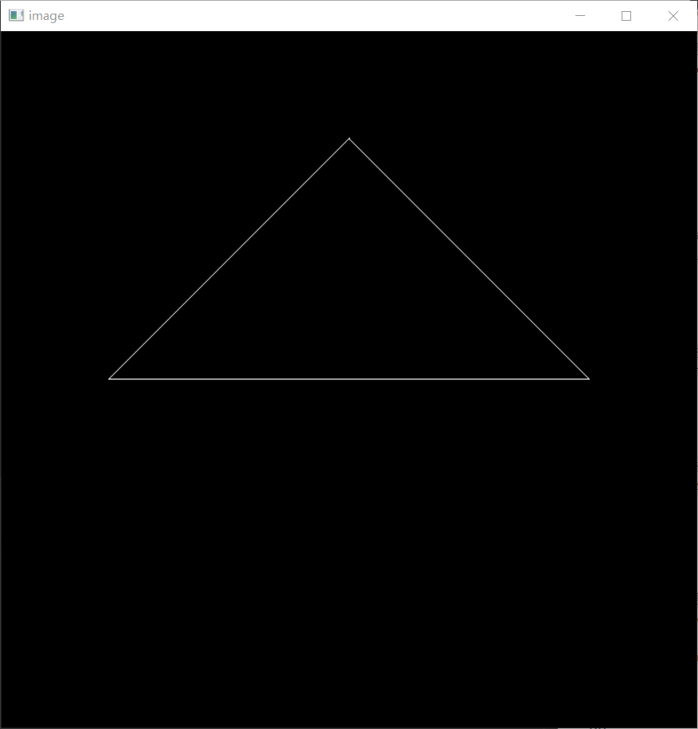

# 主要目的
熟悉模型(model)、视角(view)、投影(projection)矩阵的使用
# 实验内容
1. 填写model矩阵，本次实验为绕z轴旋转。
2. 填写projection矩阵，要求完成透视投影。
# 实验原理
对于空间中的物体，通过以下几个步骤将其投影到二维平面：
1. 对3D顶点围成的三维图形变换(旋转、平移等)。这一步为model变换。
2. 将摄像机平移到原点，并调整观测方向为-$\hat z$，向上方向为$\hat y$。这一步为view变换，将世界坐标系转为相机坐标系。
3. 将该范围内的顶点投影到近平面上。这一步为projection变换。
4. 将获得的近平面上的投影进一步转化为屏幕上的坐标。这一步为viewport变换

# 实验过程
### model矩阵
这里只需要完成绕z轴的旋转即可，对应的矩阵为：
$$
\begin{pmatrix}
\cos\theta&-\sin\theta&0&0\\
\sin\theta&\cos\theta&0&0\\
0&0&1&0\\
0&0&0&1\\
\end{pmatrix}
$$

```cpp
Eigen::Matrix4f get_model_matrix(float rotation_angle)
{
	Eigen::Matrix4f model = Eigen::Matrix4f::Identity();

	// TODO: Implement this function
	// Create the model matrix for rotating the triangle around the Z axis.
	// Then return it.
	Eigen::Matrix4f rotate;
	rotation_angle = rotation_angle / 180 * MY_PI;
	//注意三角函数接收的参数是弧度制的，需要转换
	rotate <<
		cos(rotation_angle), -sin(rotation_angle), 0, 0,
		sin(rotation_angle), cos(rotation_angle), 0, 0,
		0, 0, 1, 0,
		0, 0, 0, 1;

	model = rotate * model;

	return model;
}
```

### view矩阵
因为给定的视角方向已经正确，只需要平移至原点即可。
对应的平移矩阵为：
$$
\begin{pmatrix}
0&0&0&-eye\_pos_x\\
0&0&0&-eye\_pos_y\\
0&0&0&-eye\_pos_z\\
0&0&0&1\\
\end{pmatrix}
$$
```cpp
Eigen::Matrix4f get_view_matrix(Eigen::Vector3f eye_pos)
{
	Eigen::Matrix4f view = Eigen::Matrix4f::Identity();

	Eigen::Matrix4f translate;
	translate <<
		1, 0, 0, -eye_pos[0],
		0, 1, 0, -eye_pos[1],
		0, 0, 1, -eye_pos[2],
		0, 0, 0, 1;

	view = translate * view;

	return view;
}
```
### projection矩阵
设n和f是视锥的近点和远点，都为负数(因为看向-$\hat z$)
具体来讲，透视投影矩阵分为三个部分。
1. 将视锥变换为长方体，即将透视投影转化为正交投影。
对应的矩阵为
$$
M_{persp\to ortho}=
\begin{pmatrix}
n&0&0&0\\
0&n&0&0\\
0&0&n+f&-nf\\
0&0&1&0\\
\end{pmatrix}
$$
2. 将长方体中心平移至原点。假设在上述投影后，长方体为$[l,r]×[b,t]×[n,f]$。则对应的平移矩阵为：
$$
M_{orthoTran}=
\begin{pmatrix}
0&0&0&-(l+r)\over 2\\
0&0&0&-(b+t)\over 2\\
0&0&0&-(n+f)\over 2\\
0&0&0&1\\
\end{pmatrix}
$$
3. 将长方体缩放为标准立方体$[-1,1]^3$
$$
M_{orthoScale}=
\begin{pmatrix}
2\over r-l&0&0&0\\
0&2\over t-b&0&0\\
0&0&2\over f-n&0\\
0&0&0&1\\
\end{pmatrix}
$$
最终得到的透视投影矩阵$M_{persp}$为:
$$
M_{persp}=M_{orthoScale}M_{orthoTran}M_{persp\to ortho}
$$
这里注意相乘的顺序，必须是从右到左依次变换。
对应的代码如下。这里给定的eye_fov为视角，满足
$$
\tan({eye\_fov\over 2})= \frac{t}{n}
$$
aspect_ratio为长宽比,满足
$$
aspect\_ratio=\frac{r}{t}
$$
```cpp
Eigen::Matrix4f get_projection_matrix(float eye_fov, float aspect_ratio,
	float zNear, float zFar)
{
	// Students will implement this function

	Eigen::Matrix4f projection = Eigen::Matrix4f::Identity();

	// TODO: Implement this function
	// Create the projection matrix for the given parameters.
	// Then return it.
	//注意：传入的zNear和zFar都是正数，需手动调整为负
	eye_fov = eye_fov / 180 * MY_PI;
	float n = -zNear;
	float f = -zFar;
	float t = tan(eye_fov / 2) * abs(zNear);
	float b = -t;
	float r = t * aspect_ratio;
	float l = -r;
	Eigen::Matrix4f p2o, orthoScale, orthoTran;

	//透视转正交
	p2o <<
		n, 0, 0, 0,
		0, n, 0, 0,
		0, 0, n + f, -n * f,
		0, 0, 1, 0;
	//正交移动
	orthoTran <<
		1, 0, 0, -(l + r) / 2,
		0, 1, 0, -(t + b) / 2,
		0, 0, 1, -(f + n) / 2,
		0, 0, 0, 1;
	//正交缩放
	orthoScale <<
		2 / (r - l), 0, 0, 0,
		0, 2 / (t - b), 0, 0,
		0, 0, 2 / (n - f), 0,
		0, 0, 0, 1;

	//注意顺序，从右往左
	projection = orthoScale * orthoTran * p2o;

	return projection;
}
```
得到的结果如图：

### viewport变换
这一部分并不是需要实现的内容，但为了加深对原理的理解，我们有必要对其代码做解析。
代码在rasterizer.cpp的draw函数中可以找到:
```cpp
...
float f1 = (50 - 0.1) / 2.0;
float f2 = (50 + 0.1) / 2.0;
...
for (auto & vert : v)
{
    vert.x() = 0.5 * width * (vert.x() + 1.0);
    vert.y() = 0.5 * height * (vert.y() + 1.0);
    vert.z() = vert.z() * f1 + f2;
}
```
一般地，对视口变换的矩阵目的是将$[-1,1]^2$的平面转换为$[0,width]×[0,height]$的屏幕，所以其对应矩阵应为:
$$
M_{viewport}=\begin{pmatrix}
\frac{width}{2}&0&0&\frac{width}{2}\\
0&\frac{height}{2}&0&\frac{height}{2}\\
0&0&1&0\\
0&0&0&1\\
\end{pmatrix}
$$
需要注意的点是，作为显示器屏幕的xy坐标轴是x轴向下，y轴向右的，如果不进一步转换画出的内容会与预期不符。例如，在经过所有矩阵变换后，用断点查看得到三个顶点的二维坐标变化为：
$$
(2,0)\to(591,350)\\
(0,2)\to(350,591)\\
(-2,0)\to(108,350)
$$
如果以正常的x向右y向上的平面坐标系，则这些屏幕坐标是完全对应的。但在实际的坐标系中，得到的三角形会是倾斜的。
这里的调整方法是在get_index、set_pixel等函数中进行修改，如下:
```cpp
int rst::rasterizer::get_index(int x, int y)
{
    return (height - 1 - y) * width + x;
}

void rst::rasterizer::set_pixel(const Eigen::Vector3f& point, const Eigen::Vector3f& color)
{
    //old index: auto ind = point.y() + point.x() * width;
    if (point.x() < 0 || point.x() >= width ||
    	point.y() < 0 || point.y() >= height) 
        return;
    auto ind = (height - 1 - point.y()) * width + point.x();
    frame_buf[ind] = color;
}
```
核心在于index=(height-1-y)*width+x。对于左上角坐标为(0,height-1)的点，其index=0；对于右上角坐标为(width-1,height-1)的点，其index=width-1;对于右下角坐标为(width-1,0)的点，其index=(height-1)×width+width-1=height×weight-1。这样就完成了坐标系上的转换。
另外一点在于这里对z也进行了修改(本次实验其实用不到，在assignment2中做深度测试时用处较大)，要理解这个变换，我们要从投影变换开始计算。
首先，透视投影矩阵为
$$
M_{persp}=M_{orthoScale}M_{orthoTran}M_{persp\to ortho}=\\
\begin{pmatrix}
\frac{2n}{r-l}&0&-\frac{r+l}{r-l}&0\\
0&\frac{2n}{t-b}&-\frac{t+b}{t-b}&0\\
0&0&\frac{n+f}{n-f}&-\frac{2fn}{n-f}\\	
0&0&1&0\\			
\end{pmatrix}
$$​
所以经过这个变换后，原本相机空间中$[f,n]$上的z变为
$$
z'=\frac{\frac{n+f}{n-f}z-\frac{2fn}{n-f}}{z}\\
=\frac{n+f}{n-f}-\frac{2fn}{(n-f)z}
$$
这里除去的z实际上是变换后的w，在做齐次化。
我们看这里的f和n，满足
$$
f=-50\\
n=-0.1\\
$$
(给定的是正数，我们手动转换成了负数)
所以
$$
f_1=\frac{n-f}{2}\\
f_2=-\frac{n+f}{2}
$$
现在对z'变换，得到
$$
z''=f_1z'+f_2\\
=\frac{n-f}{2}z'-\frac{n+f}{2}\\
=-\frac{nf}{z}
$$
这也就是说,原本$[f,n]$上的z转换为了$[-n,-f]$上的z'，对原本的$z_1>z_2$(指$z_1$比$z_2$更远)变为了$z_1''>z_2''$(在正数意义上，z_2''反而更远了)。因此这一步操作的实际意义就是将得到的负数坐标z又转换成了正数，这也就是为什么在后面的assignment中深度检测时判断更近用的是小于号；但远近关系是出现了问题的，这是框架上的问题，使得在作业2中三角形的遮挡关系相反，作业3中小牛屁股对着相机，解决方法有以下2种:
1. 将z轴翻转，即在projection矩阵上的(3,3)位置取反。
2. 代码改成
```cpp
vert.z() = -vert.z() * f1 + f2;
```
这样也是将坐标从$[-1,1]$映射到$[-n,-f]$，但远近关系能够保持一致。
在之后的assignment2和3中我们统一使用方法2。
### 提高部分
要求实现绕任意过原点的三维向量旋转。
利用$Rodrigues$旋转定律:
$$
设向量为\vec a,旋转角度为\theta,则相应的旋转矩阵为：\\
R(\vec a,\theta)=\cos\theta \bold I+(1-\cos\theta)\vec a \vec a^T+\sin\theta\begin{pmatrix}
0&-a_z&a_y\\
a_z&0&-a_x\\
-a_y&a_x&0\\
\end{pmatrix}
$$
```cpp
Eigen::Matrix4f get_rotation(Vector3f axis, float angle)
{
	//用Rodrigues旋转定律
	angle = angle / 180 * MY_PI;

	Matrix3f I = Eigen::Matrix3f::Identity();
	Matrix3f N, R;
	N <<
		0, -axis[2], axis[1],
		axis[2], 0, -axis[0],
		-axis[1], axis[0], 0;
	R = cos(angle) * I + (1 - cos(angle)) * axis * axis.transpose() + sin(angle) * N;

	Matrix4f result;
	result <<
		R(0, 0), R(0, 1), R(0, 2), 0,
		R(1, 0), R(1, 1), R(1, 2), 0,
		R(2, 0), R(2, 1), R(2, 2), 0,
		0, 0, 0, 1;

	return result;
}
```