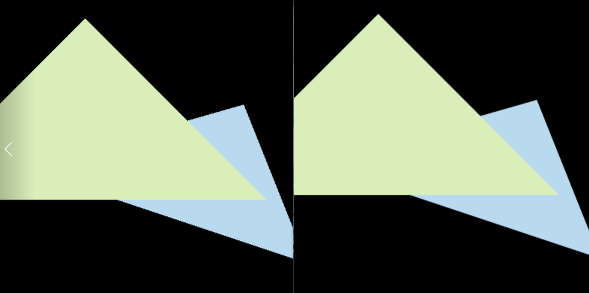

# 主要目的
对投影出的三角形完成栅格化
# 实验内容
1. 创建三角形的2维bounding box。
2. 遍历此bounding box 内的所有像素（使用其整数索引）。然后，使用像素中心的屏幕空间坐标来检查中心点是否在三角形内。
3. 如果在内部，则将其位置处的插值深度值(interpolated depth value) 与深度缓冲区(depth buffer) 中的相应值进行比较。
4. 如果当前点更靠近相机，请设置像素颜色并更新深度缓冲区(depth buffer)。
# 实验过程
### 获取bounding box
如果我们知道三角形三个顶点的坐标，我们就很容易找到这样的bounding box将三角形框住，它应当是形如$[a,b]×[c,d]$的矩形，其中
$$
a=min(x_1,x_2,x_3)\\
b=max(x_1,x_2,x_3)\\
c=min(y_1,y_2,y_3)\\
d=max(y_1,y_2,y_3)
$$
考虑到坐标均为浮点数，而像素坐标都为整数，所以对b和d最好再做一个向上取整的操作。
### 遍历bounding box内的所有像素
用一个二重循环遍历即可。
### 检测点是否在三角形内部
主要利用叉积检测。如图:

对于$\overrightarrow{AP}×\overrightarrow{AC}$，若得到的向量z值大于0，则说明AP在AC顺时针方向，反之则在逆时针方向。对三组向量的叉积都这样检测，若同号则可以说明，P点应在三角形内部。
注意这里只是在平面上检测，但叉积需要用到三维向量，这些平面上的三维向量的z值都设为0，因为并不影响结果。(由叉积公式可知，得到的z值与两个进行叉积的向量的z值无关)。
```cpp
//计算叉积的z值
//实际上有计算叉积的api，只不过我做的时候不知道
float crossProductZ(const Vector2f u, const Vector2f v)
{
    return  u.x() * v.y() - v.x() * u.y();
}

static bool insideTriangle(float x, float y, const Vector4f* _v)
{
    // TODO : Implement this function to check if the point (x, y) is inside the triangle represented by _v[0], _v[1], _v[2]
    //思路：利用叉积判断即可
    float z1 = crossProductZ(Vector2f(_v[1].x() - _v[0].x(), _v[1].y() - _v[0].y()), Vector2f(x - _v[0].x(), y - _v[0].y()));
    float z2 = crossProductZ(Vector2f(_v[2].x() - _v[1].x(), _v[2].y() - _v[1].y()), Vector2f(x - _v[1].x(), y - _v[1].y()));
    float z3 = crossProductZ(Vector2f(_v[0].x() - _v[2].x(), _v[0].y() - _v[2].y()), Vector2f(x - _v[2].x(), y - _v[2].y()));

    if ((z1 > 0 && z2 > 0 && z3 > 0) || (z1 < 0 && z2 < 0 && z3 < 0))
		return true;
    return false;
}
```
### 更新深度缓冲区
这里涉及到深度插值。我们所知道的只有三角形的三个顶点的z值，而三角形内部的点的z值是未知的，因此需要使用三角形重心坐标进行插值。
需要指出的是，作业给出的框架是有一定问题的。如下代码：
```cpp
Eigen::Vector4f v[] = 
{
    mvp * to_vec4(buf[i[0]], 1.0f),
    mvp * to_vec4(buf[i[1]], 1.0f),
    mvp * to_vec4(buf[i[2]], 1.0f)
};
//Homogeneous division
for (auto& vec : v) 
{
    vec /= vec.w();
}
//Viewport transformation
for (auto& vert : v)
{
    vert.x() = 0.5 * width * (vert.x() + 1.0);
    vert.y() = 0.5 * height * (vert.y() + 1.0);
    vert.z() = -vert.z() * f1 + f2;
    //vert.z()的更改已在assignment1中说明
}

for (int i = 0; i < 3; ++i)
{
    t.setVertex(i, v[i].head(3));
}
```
可以看出，先用mvp矩阵将三角形的三个顶点投影到平面上，然后直接将每个点的坐标除以了该点的w值，这是有问题的，因为根据projection矩阵，投影后点的w值对应了投影前（即相机空间中）的z值，齐次化时不应将w也除掉（后面有用）。
然后这样得到的投影后的坐标的前三个分量直接设置为三角形三个顶点的坐标，但在triangle.cpp中，又有这样一段代码：
```cpp
std::array<Vector4f, 3> Triangle::toVector4() const
{
    std::array<Vector4f, 3> res;
    std::transform(std::begin(v), std::end(v), res.begin(), [](auto& vec) { return Vector4f(vec.x(), vec.y(), vec.z(), 1.f); });
    return res;
}
```
可以看到是直接将顶点坐标（三维向量）加了一个1变成四维向量使用。这样原本的w（原空间中的z）就无从保留了，从而在后面的插值中出现问题。
#### 关于插值
可以详见<https://blog.csdn.net/n5/article/details/100148540>。简而言之，插值需要用到$\bold{原相机空间中的z值，即现在的w值}$。
我们可以看到作业框架给出的插值公式是这样的：
```cpp
    auto [alpha, beta, gamma] = computeBarycentric2D(x + 0.5, y + 0.5, t.v);
    float w_reciprocal = 1.0 / (alpha / v[0].w() + beta / v[1].w() + gamma / v[2].w());
    float z_interpolated = alpha * v[0].z() / v[0].w() + beta * v[1].z() / v[1].w() + gamma * v[2].z() / v[2].w();
    z_interpolated *= w_reciprocal;
```
这里的w_reciprocal对应了
$$
\frac{1}{w}=\alpha\frac{1}{w_0}+\beta\frac{1}{w_1}+\gamma\frac{1}{w_2}
$$
$w_0$、$w_1$、$w_2$对应了三角形的三个顶点在$\bold{原空间中的z值}$，对它们的倒数进行插值就能得到需要的点在原空间的深度的倒数。
z_interpolated对应了
$$
    z=(\alpha\frac{z_0}{w_0}+\beta\frac{z_1}{w_1}+\gamma\frac{z_2}{w_2})w
$$
本实验中，顶点在$\bold{投影空间内的z值}$被作为属性插值。
然而，由于toVector4函数的使用，传入顶点的w值都为1，结果就退化为了
$$
z=\alpha z_0+\beta z_1+\gamma z_2
$$
这就成了直接对投影空间的z值直接线性插值，结果是不对的。
然而最后仍能得到比较正确的结果，因为直接线性插值虽然结果不完全正确，但还是有一定的近似度的，用于Z-buffer算法误差不大。
#### 修改框架
为了得到准确的结果，我们需要对框架进行一些微小的修改。
首先，问题根源在于没有直接把三角形的顶点设置为四维向量，导致w分量没有存入应该有的值。我们把三角形的顶点改为四维向量(Vector4f)，并相应地修改对应函数的接收参数类型和初始化函数，具体修改略过。
```cpp
class Triangle{

public:
    Vector4f v[3]; /*the original coordinates of the triangle, v0, v1, v2 in counter clockwise order*/
    /*Per vertex values*/
    Vector3f color[3]; //color at each vertex;
    Vector2f tex_coords[3]; //texture u,v
    Vector3f normal[3]; //normal vector for each vertex

    //Texture *tex;
    Triangle();

    //修改：将vertex改为了4维向量，多储存一个w(代表相机空间中的z值)
    void setVertex(int ind, Vector4f ver); /*set i-th vertex coordinates */
    void setNormal(int ind, Vector3f n); /*set i-th vertex normal vector*/
    void setColor(int ind, float r, float g, float b); /*set i-th vertex color*/
    Vector3f getColor() const { return color[0]*255; } // Only one color per triangle.
    void setTexCoord(int ind, float s, float t); /*set i-th vertex texture coordinate*/
    std::array<Vector4f, 3> toVector4() const;
};
```
这样，在插值时就不需要使用toVector4函数而可以直接使用顶点了。
另外在顶点赋值这里，齐次除法不应对w分量也做除法，如下。
```cpp
Triangle t;
Eigen::Vector4f v[] = 
{
    mvp * to_vec4(buf[i[0]], 1.0f),
    mvp * to_vec4(buf[i[1]], 1.0f),
    mvp * to_vec4(buf[i[2]], 1.0f)
};
//Homogeneous division
for (auto& vec : v) 
{
    vec.x() /= vec.w();
    vec.y() /= vec.w();
    vec.z() /= vec.w();
}
//Viewport transformation
for (auto& vert : v)
{
	vert.x() = 0.5 * width * (vert.x() + 1.0);
	vert.y() = 0.5 * height * (vert.y() + 1.0);
	vert.z() = -vert.z() * f1 + f2;
}

for (int i = 0; i < 3; ++i)
{
	t.setVertex(i, v[i]);
}
```
### 深度检测
插值得到像素的z值后，就可以将该值与深度缓存(depth buffer)的相应值进行比较，若当前深度较小（更近，本次作业为方便令z值为正）就更新depth buffer并让屏幕显示当前三角形的颜色。
```cpp
for (int x = L; x <= R; ++x)
{
    for (int y = B; y <= T; ++y)
    {
	    //检测像素的中心坐标是否在三角形内
	    if (insideTriangle(x + 0.5, y + 0.5, t.v))
	    {
	    	// If so, use the following code to get the interpolated z value.
	    	// 获取插值深度值
	    	auto [alpha, beta, gamma] = computeBarycentric2D(x + 0.5, y + 0.5, t.v);
	        float w_reciprocal = 1.0 / (alpha / v[0].w() + beta / v[1].w() + gamma / v[2].w());
	        float z_interpolated = alpha * v[0].z() / v[0].w() + beta * v[1].z() / v[1].w() + gamma * v[2].z() / v[2].w();
	        z_interpolated *= w_reciprocal;

	        //与深度缓冲区的值比较
	        int index = get_index(x, y);
	        if (z_interpolated < depth_buf[index])
	        {
	      	    // TODO : set the current pixel (use the set_pixel function) to the color of
	      	    // the triangle (use getColor function) if it should be painted.
	    	    depth_buf[index] = z_interpolated;
	    	    set_pixel(Vector3f(x, y, 0), t.getColor());
	        }
    	}
    }
}
```
### 实验结果
显示图像应如下：

### 提高部分
要求基于SuperSampling完成抗锯齿。
基本思路是，对于每个像素，分成N×N个子采样点，对于每个采样点也记录它的深度和颜色，最后将这N×N个子采样点的平均颜色作为该像素的颜色。
为保存N×N个子采样点的内容，需要将depth buffer扩大，并且还需要一个color buffer记录子采样点的颜色(这是必须的，如果只是简单的将三角形颜色乘以一个在三角形内的子采样点数除以总子采样点数的话，相当于忽略了其他三角形的影响，边缘就会有无法忽略的黑线)。也很简单，把每个元素改成N×N大小的向量即可。其他的一些修改略过，主要代码如下：
```cpp
//以下为使用MSAA的结果
//N为划分数,dx,dy为差分,2d为2个采样点之间的横向、纵向距离
//mindepth维护每个像素内的最小z值，最后与zbuffer的内容比较
float d = 1.0 / (2 * N);
std::vector<float> dx(N), dy(N);
for (int i = 0; i < N; ++i)
{
    dx[i] = dy[i] = (2 * i + 1) * d;
}

    for (int x = L; x <= R; ++x)
    {
	    for (int y = B; y <= T; ++y)
	    {
	        int index = get_index(x, y);
	        //子采样点下标
	        int subIndex = 0;
	        for (int i = 0; i < N; ++i)
	        {
		        for (int j = 0; j < N; ++j)
		        {
		        	if (insideTriangle(x + dx[i], y + dy[j], t.v))
		        	{
			    	    auto [alpha, beta, gamma] = computeBarycentric2D(x + dx[i], y + dy[j], t.v);
			    	    float w_reciprocal = 1.0 / (alpha / t.v[0].w() + beta / t.v[1].w() + gamma / t.v[2].w());
			            float z_interpolated = alpha * t.v[0].z() / t.v[0].w() + beta * t.v[1].z() / t.v[1].w() + gamma * t.v[2].z() / t.v[2].w();
			            z_interpolated *= w_reciprocal;

			            if (z_interpolated < depth_buf[index][subIndex])
				        {
					        depth_buf[index][subIndex] = z_interpolated;
					        color_buf[index][subIndex] = t.getColor();
				        }
			        }
				    ++subIndex;
			    }
	        }

	        //将子采样点的颜色取平均
	        subIndex = 0;
	        Vector3f color = { 0,0,0 };
	        for (int i = 0; i < N * N; ++i)
	        {
	        	color += color_buf[index][subIndex];
	        	++subIndex;
	        }
	        color /= (N * N);
	        set_pixel(Vector3f(x, y, 0), color);
	    }
    }
```
得到的效果如下(2×2)：

与之前的效果的对比:
