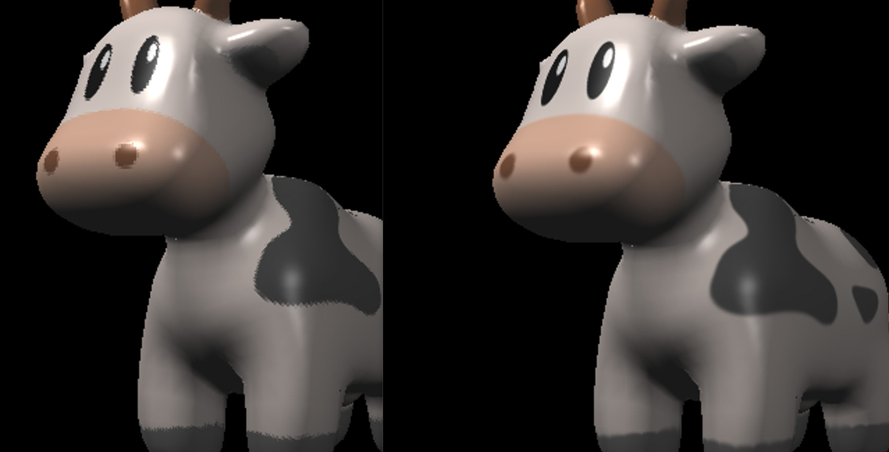

# 主要目的
1. 实现对法向量、纹理、纹理颜色的插值.
2. 实现Blinn-Phong模型.
3. 实现texture mapping.
4. 实现bump mapping.
5. 实现displacement mapping.
# 实验过程
### 重心坐标插值
在assignment2中我们提到,对于属性I有:
$$
 I=\frac{(\alpha\frac{I_0}{w_0}+\beta\frac{I_1}{w_1}+\gamma\frac{I_2}{w_2})}{\alpha\frac{1}{w_0}+\beta\frac{1}{w_1}+\gamma\frac{1}{w_2}}
$$
其中$w_i$是三角形顶点在相机空间中的深度(z值)。按照这个思路，我们将对应的属性就能得到需要插值的属性：
```cpp
auto [alpha, beta, gamma] = computeBarycentric2D(x + 0.5, y + 0.5, t.v);
float z = 1.0 / (alpha / t.v[0].w() + beta / t.v[1].w() + gamma / t.v[2].w());
float zp = alpha * t.v[0].z() / t.v[0].w() + beta * t.v[1].z() / t.v[1].w() + gamma * t.v[2].z() / t.v[2].w();
zp *= z;

auto interpolated_color = interpolate(alpha / t.v[0].w(), beta / t.v[1].w(), gamma / t.v[2].w(), t.color[0], t.color[1], t.color[2], 1 / z);
auto interpolated_normal = interpolate(alpha / t.v[0].w(), beta / t.v[1].w(), gamma / t.v[2].w(), t.normal[0], t.normal[1], t.normal[2], 1 / z);
auto interpolated_texcoords = interpolate(alpha / t.v[0].w(), beta / t.v[1].w(), gamma / t.v[2].w(), t.tex_coords[0], t.tex_coords[1], t.tex_coords[2], 1 / z);
auto interpolated_shadingcoords = interpolate(alpha / t.v[0].w(), beta / t.v[1].w(), gamma / t.v[2].w(), view_pos[0], view_pos[1], view_pos[2], 1 / z);

fragment_shader_payload payload(interpolated_color, interpolated_normal.normalized(), interpolated_texcoords, texture ? &*texture : nullptr);
payload.view_pos = interpolated_shadingcoords;
// Use: Instead of passing the triangle's color directly to the frame buffer, pass the color to the shaders first to get the final color;
auto pixel_color = fragment_shader(payload);
set_pixel(Vector2i(x, y), pixel_color); //设置颜色
depth_buf[index] = zp;
```
其中interpolate函数为
```cpp
static Eigen::Vector3f interpolate(float alpha, float beta, float gamma, const Eigen::Vector3f& vert1, const Eigen::Vector3f& vert2, const Eigen::Vector3f& vert3, float weight)
{
	return (alpha * vert1 + beta * vert2 + gamma * vert3) / weight;
}

static Eigen::Vector2f interpolate(float alpha, float beta, float gamma, const Eigen::Vector2f& vert1, const Eigen::Vector2f& vert2, const Eigen::Vector2f& vert3, float weight)
{
	auto u = (alpha * vert1[0] + beta * vert2[0] + gamma * vert3[0]);
	auto v = (alpha * vert1[1] + beta * vert2[1] + gamma * vert3[1]);

	u /= weight;
	v /= weight;

	return Eigen::Vector2f(u, v);
}
```
而z即assignment2中的w_reciprocal，zp即z_interpolated。
这里插值的四个属性分别为：
1. 颜色
2. 法向量
3. 纹理坐标
4. 着色坐标(对view_pos，即相机空间中的三角形顶点插值得到内部顶点坐标)
并将它们都载入到fragment_shader_payload上。
### 法向量实现:normal_fragment_shader
在完成了对法向量的插值后，根据normal_fragment_shader就能看到结果
```cpp
Eigen::Vector3f normal_fragment_shader(const fragment_shader_payload& payload)
{
	Eigen::Vector3f return_color = (payload.normal.head<3>().normalized() + Eigen::Vector3f(1.0f, 1.0f, 1.0f)) / 2.f;
	Eigen::Vector3f result;
	result << return_color.x() * 255, return_color.y() * 255, return_color.z() * 255;
	return result;
}
```
结果如下:

### Blinn-Phong模型的实现
Blinn-Phong光照模型分为三个部分:
1. 环境光照(ambient)
$$
l_a=k_aI_a
$$
$k_a$是环境光系数,$I_a$是环境光强（视为平行光）。
2. 漫反射光(diffuse)
$$
l_d=k_d\frac{I}{r^2}\max(0,\cos(\hat{n}·\hat{l}))
$$
$k_d$是漫反射系数,I是光源的光强,r是光源到着色点的距离,$\hat{n}$和$\hat{l}$分别是法线向量和光线方向向量(都是单位向量)
3. 镜面反射高光(specular)
$$
l_s=k_s\frac{I}{r^2}\max(0,\cos(\hat{r}·\hat{v}))^p\\
=k_s\frac{I}{r^2}\max(0,\cos(\hat{n}·\hat{h}))^p
$$
$k_d$是漫反射系数,I是光源的光强,r是光源到着色点的距离,$\hat{n}$和$\hat{l}$分别是法线向量和光线方向向量,$\hat{r}$和$\hat{v}$分别是反射方向和观测方向(都是单位向量)。而$\hat{h}$是半程向量，计算方法为:
$$
\hat{h}=\frac{\hat{l}+\hat{v}}{|\hat{l}+\hat{v}|}
$$
p用于控制高光范围，越大高光范围越小。
具体代码实现如下:
```cpp
Eigen::Vector3f phong_fragment_shader(const fragment_shader_payload& payload)
{
	Eigen::Vector3f ka = Eigen::Vector3f(0.005, 0.005, 0.005);
	Eigen::Vector3f kd = payload.color;
	Eigen::Vector3f ks = Eigen::Vector3f(0.7937, 0.7937, 0.7937);

	auto l1 = light{ {20, 20, 20}, {500, 500, 500} };
	auto l2 = light{ {-20, 20, 0}, {500, 500, 500} };

	std::vector<light> lights = { l1, l2 };
	Eigen::Vector3f amb_light_intensity{ 10, 10, 10 };		//环境光强
	Eigen::Vector3f eye_pos{ 0, 0, 10 };				//观测点

	float p = 150;

	Eigen::Vector3f color = payload.color;
	Eigen::Vector3f point = payload.view_pos;			//着色点
	Eigen::Vector3f normal = payload.normal;			//法向量

	Eigen::Vector3f result_color = { 0, 0, 0 };
	for (auto& light : lights)
	{
		// TODO: For each light source in the code, calculate what the *ambient*, *diffuse*, and *specular* 
		// components are. Then, accumulate that result on the *result_color* object.
		Vector3f light_direction = (light.position - point).normalized();		//光照方向
		Vector3f view_direction = (eye_pos - point).normalized();			//观测方向
		Vector3f h = (light_direction + view_direction).normalized();			//半程向量
		Vector3f n = normal.normalized();
		float light_distance = (light.position - point).squaredNorm();			//光源距离(的平方)

		//cwiseproduct将矩阵的对应位置的数直接相乘
		//环境光ambient
		Vector3f la = ka.cwiseProduct(amb_light_intensity);
		//漫反射diffuse(这里要类型转换了才能乘float类型，镜面反射同理)
		Vector3f ld = kd.cwiseProduct(light.intensity / light_distance);
		ld *= std::max(0.f, n.dot(light_direction));
		//镜面反射specular
		Vector3f ls = ks.cwiseProduct(light.intensity / light_distance);
		ls *= pow(std::max(0.f, n.dot(h)), p);

		//必须写成+=，因为这里有2束光，写成=就成了只有最后一束光的效果了
		result_color += la + ld + ls;
	}

	return result_color * 255.f;
}
```
得到的结果如下:

### 实现纹理映射:texture mapping
纹理映射的基本思想就是将一个点与其纹理坐标绑定在一起。也即:
$$
(x,y,z)\rightarrow(u,v),u,v\in[0,1]
$$
我们在插值部分已经得到了三角形内部每个点的纹理坐标texture_coords，因此直接获取即可。如下代码:
```cpp
if (payload.texture)
{
	// TODO: Get the texture value at the texture coordinates of the current fragment
	// 之前已经在resterize_triangle函数中将插值的纹理坐标放入了payload中，直接读取即可
		
	return_color = payload.texture->getColor(payload.tex_coords.x(), payload.tex_coords.y());
	//return_color = payload.texture->getColorBilinear(payload.tex_coords.x(), payload.tex_coords.y());
}
Eigen::Vector3f texture_color;
texture_color << return_color.x(), return_color.y(), return_color.z();
```
这里getColor函数能获取给定纹理坐标的颜色。
用获取的texture_color代替原本漫反射系数$k_d$后就完成了texture mapping
```cpp
Eigen::Vector3f kd = texture_color / 255.f;
```
效果如下:

### 实现凹凸映射:bump mapping
凹凸映射的原理是，通过修正法向量来使得贴图看上去显得凹凸不平，但顶点本身的位置并不发生变化。
因为凹凸映射的具体实现原理涉及到TBN矩阵，这在后面的光线追踪部分会详细叙述，不做展开。
```cpp
float kh = 0.2, kn = 0.1;

// TODO: Implement bump mapping here
// Let n = normal = (x, y, z)
// Vector t = (x*y/sqrt(x*x+z*z),sqrt(x*x+z*z),z*y/sqrt(x*x+z*z))
// Vector b = n cross product t
// Matrix TBN = [t b n]
// dU = kh * kn * (h(u+1/w,v)-h(u,v))
// dV = kh * kn * (h(u,v+1/h)-h(u,v))
// Vector ln = (-dU, -dV, 1)
// Normal n = normalize(TBN * ln)
Vector3f n = normal.normalized();
float x = n.x();
float y = n.y();
float z = n.z();
Vector3f t(x * y / sqrt(x * x + z * z), sqrt(x * x + z * z), z * y / sqrt(x * x + z * z));
Vector3f b = n.cross(t);
Matrix3f TBN;
TBN <<
	t.x(), b.x(), n.x(),
	t.y(), b.y(), n.y(),
	t.z(), b.z(), n.z();
float w = payload.texture->width;
float h = payload.texture->height;
float u = payload.tex_coords.x();
float v = payload.tex_coords.y();

//这里h函数对应getColor(u,v).norm()
float dU = kh * kn * (payload.texture->getColor(u + 1.0 / w, v).norm() - payload.texture->getColor(u, v).norm());
float dV = kh * kn * (payload.texture->getColor(u, v + 1.0 / h).norm() - payload.texture->getColor(u, v).norm());
Vector3f ln(-dU, -dV, 1);

Eigen::Vector3f result_color = { 0, 0, 0 };
result_color = (TBN * ln).normalized();

return result_color * 255.f;	
```
实现效果如下:

### 移位映射:displacement mapping
大体原理和凹凸映射是一致的，区别在于移位映射的顶点实际上也发生了移动。具体原理也不作展开。以下是关键代码。
```cpp
//这里h(u,v)对应getColor(u,v).norm()
float dU = kh * kn * (payload.texture->getColor(u + 1.0 / w, v).norm() - payload.texture->getColor(u, v).norm());
float dV = kh * kn * (payload.texture->getColor(u, v + 1.0 / h).norm() - payload.texture->getColor(u, v).norm());
Vector3f ln(-dU, -dV, 1);
point = point + (kn * n * payload.texture->getColor(u, v).norm());
n = (TBN * ln).normalized();
```
实现效果如下:

### 提高部分:双线性插值
我们首先要先看一下我们所使用的getColor函数。
```cpp
Eigen::Vector3f getColor(float u, float v)
{
	if (u < 0 || u > 1 || v < 0 || v > 1)
		return Eigen::Vector3f(0, 0, 0);

	//auto u_img = u * width;
	//auto v_img = (1 - v) * height;
	//原计算方法在u,v=1时会越界，应修正如下:
	auto u_img = u * (width - 1);
	auto v_img = (1 - v) * (height - 1);

	//注意这里u,v代入是相反的，在双线性插值中必须按这个顺序
	auto color = image_data.at<cv::Vec3b>(v_img, u_img);
	return Eigen::Vector3f(color[0], color[1], color[2]);
}
```
可以看到通过给定的纹理坐标$(u,v)$计算得到对应图片上的坐标从而获取对应颜色。由于image_data.at函数接收int参数，所以这里相当于直接舍去了小数部分向下取整，取了该点的颜色。
通过双线性插值，我们希望不直接取得接近的整数点的颜色，而是根据周围四个点的颜色加权平均。算法如下:
$$
设u=(x,y)是对应的点的某属性,则\\
u_{00}=(x_0,y_0)\\
u_{01}=(x_0,y_1)\\
u_{10}=(x_1,y_0)\\
u_{11}=(x_1,y_1)\\
其中x_0=int(x),y_0=int(y),x_1=x_0+1,y_1=y_0+1\\
也即分别是u左下、左上、右下、右上的点\\
(实际上按图片的坐标系来讲是左上、右上、左下、右下，但我们在传入参数时已经修正过了)\\
$$
令
$$
s=x-x_0\\
t=y-y_0\\
$$
从而
$$
u_0=u_{00}+s(u_{10}-u_{00})\\
u_1=u_{10}+s(u_{11}-u_{10})
$$
所以
$$
u_{bilinear}=u_0+t(u_1-u_0)
$$
代码如下:
```cpp
//双线性插值
Eigen::Vector3f getColorBilinear(float u, float v)
{
	if (u < 0 || u > 1 || v < 0 || v > 1)
		return Eigen::Vector3f(0, 0, 0);

	auto y = u * (width - 1);
	auto x = (1 - v) * (height - 1);

	int x0 = x, x1 = std::min(x0 + 1, height - 1);
	int y0 = y, y1 = std::min(y0 + 1, width - 1);

	//双线性插值修正 
	auto u01 = get(x0, y1);
	auto u11 = get(x1, y1);
	auto u00 = get(x0, y0);
	auto u10 = get(x1, y0);

	float s = x - x0;
	float t = y - y0;

	Eigen::Vector3f u0 = u00 + s * (u10 - u00);
	Eigen::Vector3f u1 = u01 + s * (u11 - u01);
	Eigen::Vector3f color = u0 + t * (u1 - u0);

	return color;
}

//给定图片坐标获取颜色
Eigen::Vector3f get(float x, float y)
{
	auto color = image_data.at<cv::Vec3b>(x, y);
	return Eigen::Vector3f(color[0], color[1], color[2]);
}
```
对$x_1$和$y_1$的限制主要是防止越界。
得到的效果如下:

与之前的图片进行对比:

可以看到眼睛和身上的黑色部分边缘都变得平滑了很多。
用低像素(612×612)的纹理进行对比，差别更加明显：
