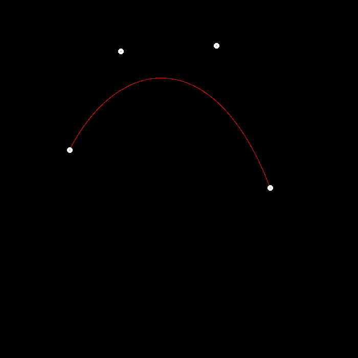
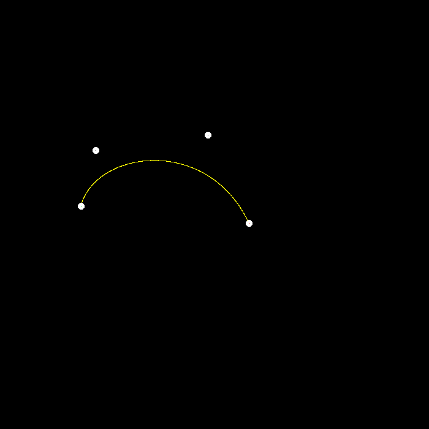
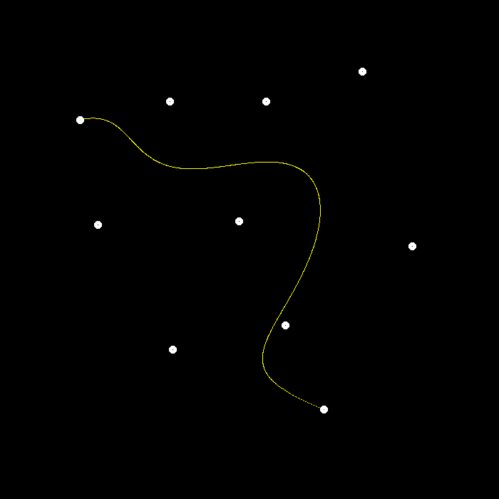
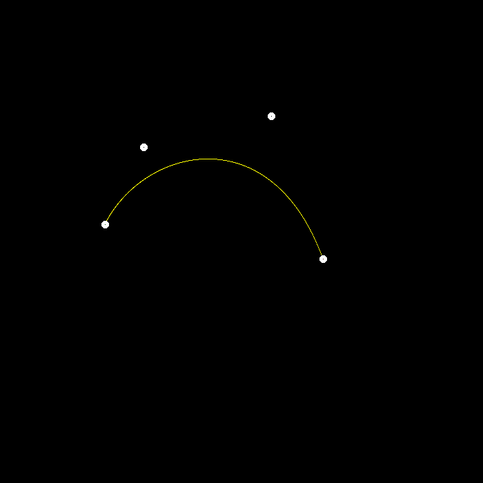
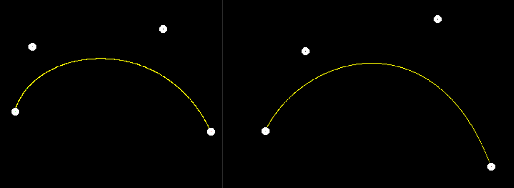

# 主要目的
实现贝塞尔曲线的递归形式
# 实验原理
对于给定的n个控制点$p_0^0$,$p_1^0$,...,$p_{n-1}^0$,可以得到一条n-1次曲线。
考虑参数t，令
$$
p_i^1=tp_i^0+(1-t)p_{i+1}^0,i=0,1,2,...,n-2
$$
再对得到的这n-1个点做同样的操作，直到得到的序列只有一个点，该点就在贝塞尔曲线上。
如果我们消去中间结果，可以得到
$$
p_0^{n-1}=\sum_{i=0}^{n-1}{i\choose n-1}(1-t)^{n-1-i}t^ip_i^0
$$
这其实就是Bernstein多项式。
# 实验过程
## 递归计算
根据公式得到即可。
```cpp
cv::Point2f recursive_bezier(const std::vector<cv::Point2f>& control_points, float t)
{
	// TODO: Implement de Casteljau's algorithm
    if (control_points.size() == 1)
	    return control_points[0];

    std::vector<cv::Point2f> temp;
    for (int i = 0; i < control_points.size() - 1; ++i)
    {
    	temp.push_back(control_points[i] * t + control_points[i + 1] * (1 - t));
    }
    return recursive_bezier(temp, t);
}
```
## 曲线绘制
遍历t从0到1，每次增加一个微小量$dt$得到该t值对应的点，就能绘制出整条曲线。
```cpp
void bezier(const std::vector<cv::Point2f>& control_points, cv::Mat& window)
{
    // TODO: Iterate through all t = 0 to t = 1 with small steps,    and call de Casteljau's 
    // recursive Bezier algorithm.
    float dt = 0.001;
    float t = 0;
    for (t = 0; t <= 1; t += dt)
    {
    	auto point = recursive_bezier(control_points, t);

    	window.at<cv::Vec3b>(point.y, point.x)[2] = 255;//设置为红色
    }
}

```
## 实现效果
单独调用bezier函数，得到图像如下:

与实验提供的native_bezier函数(消去了中间项)的效果比较，二者一起调用，且native_bezier函数绘制绿色曲线，若结果相近应得到黄色曲线。

## 提高部分
### 任意多次的曲线绘制
先定义控制点个数
```cpp
#define CONTROL_POINTS_NUM 4
```
对于递归算法不需要改动；对于直接生成的算法，需要更改其公式。
首先定义计算组合数的函数，利用公式
$$
{m\choose n}={m-1 \choose n}+{m-1 \choose n-1}
$$
代码如下:
```cpp
int comb(int m, int n)
{
    if (m < n)
    	return 0;
    if (m == n)
    	return 1;
    if (n == 0)
    	return 1;
    if (n == 1)
    	return m;

    return comb(m - 1, n) + comb(m - 1, n - 1);
}

void naive_bezier(const std::vector<cv::Point2f>& points, cv::Mat& window)
{
    cv::Point2f point;
    int n = points.size();

    for (double t = 0.0; t <= 1.0; t += 0.001)
    {
    	for (int i = 0; i < n; ++i)
    	{
    		point += comb(n - 1, i) * pow(1 - t, n - 1 - i) * pow(t, i) * points[i];
    	}
    	window.at<cv::Vec3b>(point.y, point.x)[1] = 255;
    	point = { 0,0 };//注意对每个t清一次0
    }
}
```
10个控制点得到的9次曲线如图:

可以看到两种方式的重合度很高。
### Bezier曲线的抗锯齿处理
因为window.at接收的参数必须是整数，所以直接传入点坐标的话相当于每次取了一个偏左下的整数点着相应的颜色。为了使曲线看上去更加平滑，考虑对于获得点与对应像素内部的四个点的距离进行颜色的加权，使离整数点更远那些点着色更暗一些，从而显得更加平滑。
考虑到点到内部四个点的最大距离应为$\sqrt{0.75^2×2}=\sqrt{1.125}$，就以该距离为标准来求权重。代码如下：
```cpp
void antiAliasing(cv::Point2f point, cv::Mat& window，int c)
{
    int x = point.x;
    int y = point.y;
    float maxDis = std::sqrt(1.125);
    float color1 = 255 * (maxDis - std::sqrt(pow(point.x - x - 0.25f, 2) + pow(point.y - y - 0.25f, 2))) / maxDis;
    float color2 = 255 * (maxDis - std::sqrt(pow(point.x - x - 0.75f, 2) + pow(point.y - y - 0.25f, 2))) / maxDis;
    float color3 = 255 * (maxDis - std::sqrt(pow(point.x - x - 0.25f, 2) + pow(point.y - y - 0.75f, 2))) / maxDis;
    float color4 = 255 * (maxDis - std::sqrt(pow(point.x - x - 0.75f, 2) + pow(point.y - y - 0.75f, 2))) / maxDis;
    int color = (color1 + color2 + color3 + color4) / 4.f;
    window.at<cv::Vec3b>(point.y, point.x)[c] = std::min(255, color + window.at<cv::Vec3b>(point.y, point.x)[c]);
}
```
这里用maxDis减去实际距离确保了离这些点更远的点其着色应更淡。效果如下:

与未处理的曲线比较:
