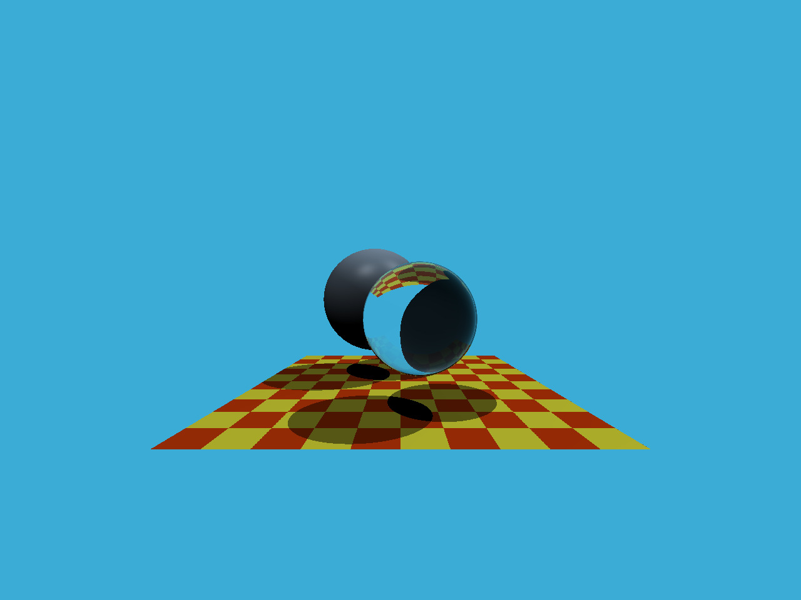
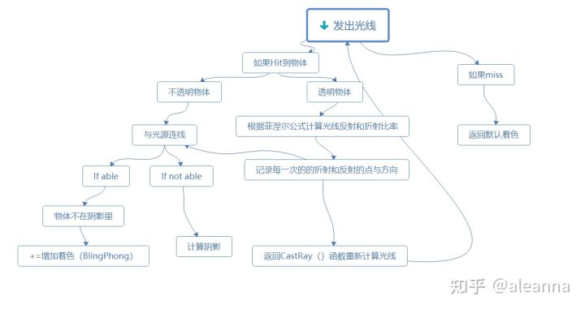

# 主要目的
1. 实现Render()函数，为每个像素生成一道光线。
2. 实现rayTriangleIntersect()函数，给定判定光线与三角形相交的算法。
# 实验过程
## 生成光线
生成光线的方法很简单，基于光路可逆原理，我们可以认为从眼睛出发，经过像素形成一条光线。现在我们已知眼睛的位置eye_pos(在经过view变换后，这个点就是原点)，需要的就是**给定像素对应在相机空间中的坐标。**
相机空间中的坐标需要先应用projection矩阵，再应用viewport矩阵才能变为屏幕空间中的像素坐标。因此我们需要做的就是这样一个逆变换。
由于本实验中没有给定相应的mvp矩阵，我们将其变换到投影空间中即可。
设在投影空间中，某点的坐标为(x,y)，对于视口变换矩阵
$$
M_{viewport}=\begin{pmatrix}
\frac{width}{2}&0&0&\frac{width}{2}\\
0&\frac{height}{2}&0&\frac{height}{2}\\
0&0&1&0\\
0&0&0&1\\
\end{pmatrix}
$$
有
$$
x'=\frac{width}{2}(x+1)\\
y'=\frac{height}{2}(y+1)\\
$$
从上面两式，反解有
$$
x=\frac{2x'}{width}-1\\
y=\frac{2y'}{height}-1
$$
这样就从$[0,width]×[0,height]$又转换到$[-1,1]^2$上。
另外再注意到以下两点:
1. 我们知道屏幕坐标系是以向右为y轴，向下为x轴，从而需要有相应的调整。
可以看到遍历像素的for循环写为:
```cpp
for (int j = 0; j < scene.height; ++j)
    for (int i = 0; i < scene.width; ++i)
```
可以看出j对应了屏幕坐标系下的x，i对应y。
如果我们想要把i和j转换为实际的x'和y'，应有:
$$
x'=i\\
y'=height-1-j
$$
再考虑到像素坐标用像素中心代表，修正为
$$
x'=i+0.5\\
y'=height-1-(j+0.5)=height-j-1.5
$$
代入得
$$
x=\frac{2(i+0.5)}{width}-1\\
y=\frac{2(height-1.5-j)}{height}-1\\
=1-\frac{2(1.5+j)}{height}
$$
2. 我们还需要将视野扩大，给定了scale和imageAspectRatio两个比例，得到
$$
x_{final}=x×scale×imageAspectRatio\\
y_{final}=y×scale
$$
最终代码如下:
```cpp
std::vector<Vector3f> framebuffer(scene.width * scene.height);

float scale = std::tan(deg2rad(scene.fov * 0.5f));
float imageAspectRatio = scene.width / (float)scene.height;

// Use this variable as the eye position to start your rays.
Vector3f eye_pos(0);
int m = 0;
for (int j = 0; j < scene.height; ++j)
{
    for (int i = 0; i < scene.width; ++i)
    {
	    // generate primary ray direction
	    float x;
	    float y;
	    // TODO: Find the x and y positions of the current pixel to get the direction
	    // vector that passes through it.
	    // Also, don't forget to multiply both of them with the variable *scale*, and
	    // x (horizontal) variable with the *imageAspectRatio*            
	    x = scale * imageAspectRatio * (2 * (i + 0.5f) / float(scene.width) - 1);
	    y = scale * (1 - (2 * (j + 1.5f) / float(scene.height)));
	    Vector3f dir = Vector3f(x, y, -1); // Don't forget to normalize this direction!
	    normalize(dir);
	    framebuffer[m++] = castRay(eye_pos, dir, scene, 0);
    }
    UpdateProgress(j / (float)scene.height);
}
```
## 判断与三角形相交
### 普遍思想
一般地，比较普遍的办法是:
1. 先将光线与三角形所在的平面求交点。
2. 判断交点是否在三角形内。
对于求交点，设平面法向量为$\vec{n}$，光线为$\vec{P}(t)=\vec{O}+t\vec{D}$,平面上一点$\vec{P'}$，则应有:
$$
(\vec{P}-\vec{P'})·\vec{n}=0
$$
代入解得
$$
t=\frac{(\vec{P'}-\vec{O})·\vec{n}}{\vec{D}·\vec{n}}
$$
比如给定了三角形的三个顶点，法向量可以通过求两条边的叉积获得，点可以随便取三角形的一点。
对于判断交点是否在三角形内，这在之前的实验中已经涉及过了。
### $Moller-Trumbore$算法
令$\vec{O}+t\vec{D}=(1-u-v)\vec{P_0}+u\vec{P_1}+v\vec{P_2}$,即表示为重心坐标。
对该式进行如下变形:
$$
\vec{O}+t\vec{D}=\vec{P_0}+u(\vec{P_1}-\vec{P_0})+v(\vec{P_2}-\vec{P_0})\\
\Rightarrow\vec{O}-\vec{P_0}=-t\vec{D}+u(\vec{P_1}-\vec{P_0})+v(\vec{P_2}-\vec{P_0})\\
\Rightarrow(-\vec{D},\vec{P_1}-\vec{P_0},\vec{P_2}-\vec{P_0})
\begin{pmatrix}
t\\b_1\\b_2	
\end{pmatrix}
=\vec{O}-\vec{P_0}
$$
(向量均为3维列向量)
定义
$$
\vec{E_1}=\vec{P_1}-\vec{P_0}\\
\vec{E_2}=\vec{P_2}-\vec{P_0}\\
\vec{S}=\vec{O}-\vec{P_0}\\
\vec{S_1}=\vec{D}×\vec{E_2}\\
\vec{S_2}=\vec{S}×\vec{E_1}
$$
所以上式变为
$$
(-\vec{D},\vec{E_1},\vec{E_2})
\begin{pmatrix}
t\\u\\v	
\end{pmatrix}
=\vec{S}
$$
利用$Cramer$法则，有
$$
t=\frac{\det(\vec{S},\vec{E_1},\vec{E_2})}{\det(-\vec{D},\vec{E_1},\vec{E_2})}\\
b_1=\frac{\det(-\vec{D},\vec{S},\vec{E_2})}{\det(-\vec{D},\vec{E_1},\vec{E_2})}\\
b_2=\frac{\det(-\vec{D},\vec{E_1},\vec{S})}{\det(-\vec{D},\vec{E_1},\vec{E_2})}
$$
由行列式和叉积的几何性质可知
$$
\det(\vec{A},\vec{B},\vec{C})=(\vec{A}×\vec{B})·\vec{C}=(\vec{B}×\vec{C})·\vec{A}=(\vec{C}×\vec{A})·\vec{B}
$$
所以有
$$
\det(-\vec{D},\vec{E_1},\vec{E_2})=(\vec{E_2}×-\vec{D})·\vec{E_1}=\vec{S_1}·\vec{E_1}
$$
同理
$$
\det(\vec{S},\vec{E_1},\vec{E_2})=\vec{S_2}·\vec{E_2}\\
\det(-\vec{D},\vec{S},\vec{E_2})=\vec{S_1}·\vec{S}\\
\det(-\vec{D},\vec{E_1},\vec{S})=\vec{S_2}·\vec{D}
$$
代入即得
$$
\begin{pmatrix}
t\\
u\\
v
\end{pmatrix}=\frac{1}{\vec{S_1}·\vec{E_1}}
\begin{pmatrix}
\vec{S_2}·\vec{E_2}\\
\vec{S_1}·\vec{S}\\
\vec{S_2}·\vec{D}	
\end{pmatrix}\\
$$
对于得到的结果:
1. 光线穿过了三角形所在平面当且仅当$t\ge0$;
2. 交点在三角形内当且仅当重心坐标的分量都在$[0,1]$之间，即:$u\ge0,v\ge0,u+v\le1$
当上述条件都满足时就判定光线与三角形相交了，否则不相交。代码如下:
```cpp
bool rayTriangleIntersect(const Vector3f& v0, const Vector3f& v1, const Vector3f& v2, const Vector3f& orig,
const Vector3f& dir, float& tnear, float& u, float& v)
{
    // TODO: Implement this function that tests whether the triangle
    // that's specified bt v0, v1 and v2 intersects with the ray (whose
    // origin is *orig* and direction is *dir*)
    // Also don't forget to update tnear, u and v.
    Vector3f E1 = v1 - v0;
    Vector3f E2 = v2 - v0;
    Vector3f S = orig - v0;
    Vector3f S1 = crossProduct(dir, E2);
    Vector3f S2 = crossProduct(S, E1);
    Vector3f result = 1 / dotProduct(S1, E1) * Vector3f { dotProduct(S2, E2), dotProduct(S1, S), dotProduct(S2, dir) };
    tnear = result.x;
    u = result.y;
    v = result.z;

    return tnear >= 0 && u >= 0 && v >= 0 && u + v <= 1;
}
```
注意这里把t、u、v作为参数传入，并在函数内进行了更新。
## 实验结果
得到的图片如下:

## 实验框架研究
本次实验我们只完成了发出光线和判断光线与三角形是否相交的方法，其他的办法都已经在框架中包含了。
对于Whitted-Style光线追踪，基本思路如下图:

一些具体的原理可以参考:
<https://zhuanlan.zhihu.com/p/144403005>
