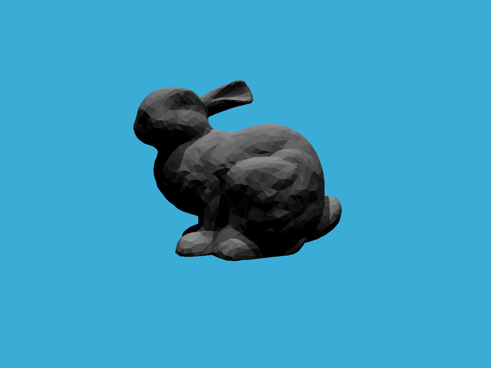
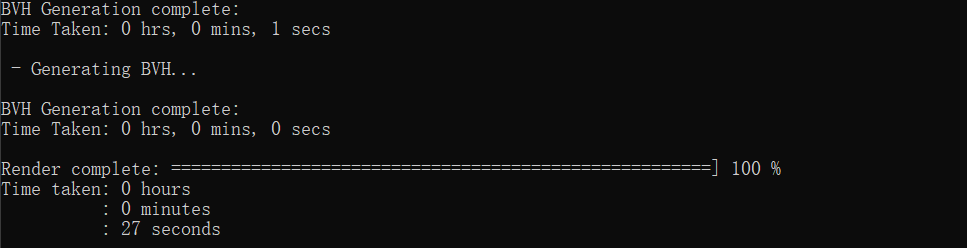
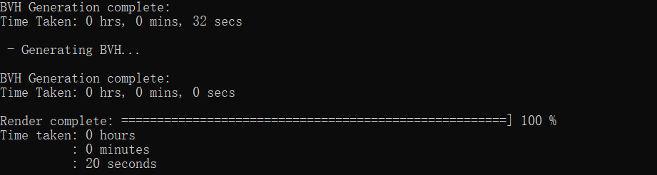
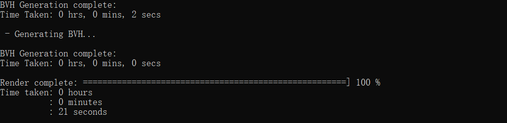

# 主要目的
1. 实现判断光线与AABB包围盒是否相交的判断，并求出交点。
2. 基于BVH，加速三角形求交过程。
# 实验过程
## 复制代码
先将在assignment5中实现的生成光线函数和判断与三角形是否求交的函数粘贴过来。
Render in Renderer.cpp:
```cpp
float x = (2 * (i + 0.5) / (float)scene.width - 1) *imageAspectRatio * scale;
float y = (1 - 2 * (j + 0.5) / (float)scene.height) * scale;
// TODO: Find the x and y positions of the current pixel to get the
// direction
// vector that passes through it.
// Also, don't forget to multiply both of them with the variable
// *scale*, and x (horizontal) variable with the *imageAspectRatio*
// Don't forget to normalize this direction!
Vector3f dir = Vector3f(x, y, -1);
normalize(dir);
//注意现在castRay定义于Scene.cpp中
framebuffer[m++] = scene.castRay(Ray(eye_pos, dir), 0);
```
getIntersection in Triangle.hpp:
```cpp
inline Intersection Triangle::getIntersection(Ray ray)
{
	Intersection inter;

	if (dotProduct(ray.direction, normal) > 0)
		return inter;
	double u, v, t_tmp = 0;
	//pvec=D×E2即S1
	Vector3f pvec = crossProduct(ray.direction, e2);
	//det=S1点乘E1，是右边的分母
	double det = dotProduct(e1, pvec);
	//当分母为0时认为没相交
	if (fabs(det) < EPSILON)
		return inter;

	double det_inv = 1. / det;
	//tvec即S
	Vector3f tvec = ray.origin - v0;
	u = dotProduct(tvec, pvec) * det_inv;
	//u不在0、1之间则不相交
	if (u < 0 || u > 1)
		return inter;
	//qvec=S×E1即S2
	Vector3f qvec = crossProduct(tvec, e1);
	v = dotProduct(ray.direction, qvec) * det_inv;
	//同上判断条件
	if (v < 0 || u + v > 1)
		return inter;
	t_tmp = dotProduct(e2, qvec) * det_inv;

	// TODO find ray triangle intersection
	if (t_tmp < 0)
		return inter;

	//以上条件都不满足则相交了。注意把inter的相关信息补充完整。
	inter.happened = true;
	inter.coords = ray(t_tmp);
	inter.normal = normal;
	inter.distance = t_tmp;
	inter.obj = this;		//因为Triangle是Object的子类
	inter.m = m;

	return inter;
}
```
有关Ray和Intersection类的具体定义可以查看相关代码。
## 判断与包围盒是否相交
基本思路是，对$[x_0,x_1]×[y_0,y_1]×[z_0,z_1]$的包围盒，考虑令
$$
(\vec{O}+t\vec{D}).x=x_0
$$
可以解得
$$
t_{x_0}=\frac{x_0-\vec{O}.x}{\vec{D}.x}
$$
这就是光线与$x=x_0$平面相交的时间。同上，我们就可以计算出光线与6个平面各自相交的时间。
然后我们需要得到光线进入包围盒的时间$t_{enter}$和退出包围盒的时间$t_{exit}$。不难想象有
$$
t_{enter}=\max(t_{x_{enter}},t_{y_{enter}},t_{z_{enter}})（全部进入才算进入）\\
t_{exit}=\min(t_{x_{exit}},t_{y_{exit}},t_{z_{exit}})（一个分量退出就算退出）
$$
一般地，若光线方向向量$\vec{D}$的x分量大于0，则它应该先经过$x_0$，再经过$x_1$，从而有
$$
t_{x_{enter}}=t_0\\
t_{x_{exit}}=t_1
$$
若x分量小于0则反之。
得到$t_{enter}$和$t_{exit}$后需要判断怎样算是相交了，条件为以下两个:
$$
t_{enter}\le t_{exit}\\
t_{exit}\ge0
$$
相关代码如下:
```cpp
//判断光线是否与boundingbox相交
inline bool Bounds3::IntersectP(const Ray& ray, const Vector3f& invDir,
	const std::array<int, 3>& dirIsNeg) const
{
	// invDir: ray direction(x,y,z), invDir=(1.0/x,1.0/y,1.0/z), use this because Multiply is faster that Division
	// dirIsNeg: ray direction(x,y,z), dirIsNeg=[int(x>0),int(y>0),int(z>0)], use this to simplify your logic
	// TODO test if ray bound intersects
	//注意需要考虑光线方向正负的问题,为负的时候是先与pMax交再与pMin交
	double t1 = 0, t2 = 0;
	t1 = (pMin.x - ray.origin.x) * invDir.x;
	t2 = (pMax.x - ray.origin.x) * invDir.x;
	double txmin = dirIsNeg[0] > 0 ? t1 : t2;
	double txmax = dirIsNeg[0] > 0 ? t2 : t1;

	t1 = (pMin.y - ray.origin.y) * invDir.y;
	t2 = (pMax.y - ray.origin.y) * invDir.y;
	double tymin = dirIsNeg[1] > 0 ? t1 : t2;
	double tymax = dirIsNeg[1] > 0 ? t2 : t1;

	t1 = (pMin.z - ray.origin.z) * invDir.z;
	t2 = (pMax.z - ray.origin.z) * invDir.z;
	double tzmin = dirIsNeg[2] > 0 ? t1 : t2;
	double tzmax = dirIsNeg[2] > 0 ? t2 : t1;

	double t_min = std::max(std::max(txmin, tymin), tzmin);
	double t_max = std::min(std::min(txmax, tymax), tzmax);

	return t_min <= t_max && t_max >= 0;
}
```
## BVH加速
BVH是一种通过不断划分三角形集合从而加速判断是否与三角形相交的技术。本次实验中，BVH实质上是一棵二叉树，其结构定义如下:
```cpp
//BVHBuildNode是有一个包围盒和其对象指针的二叉树结点
struct BVHBuildNode {
    Bounds3 bounds;
    BVHBuildNode *left;
    BVHBuildNode *right;
    Object* object;
    ...
}
```
BVH.cpp中的recursiveBuild函数是将给定的object(本实验中为三角形)列表不断分割并建立一棵二叉树的函数。
```cpp
//根据object列表，递归构建BVH二叉树
BVHBuildNode* BVHAccel::recursiveBuild(std::vector<Object*> objects)
{
	BVHBuildNode* node = new BVHBuildNode();

	// Compute bounds of all primitives in BVH node
	Bounds3 bounds;
	//将所有object的包围盒并起来，这作为根节点(本次递归的当前结点)的bounds
	for (int i = 0; i < objects.size(); ++i)
		bounds = Union(bounds, objects[i]->getBounds());
	if (objects.size() == 1) {
		// Create leaf _BVHBuildNode_
		//叶子结点才有对象
		node->bounds = objects[0]->getBounds();
		node->object = objects[0];
		node->left = nullptr;
		node->right = nullptr;
		return node;
	}
	else if (objects.size() == 2) {
		node->left = recursiveBuild(std::vector{ objects[0] });
		node->right = recursiveBuild(std::vector{ objects[1] });

		node->bounds = Union(node->left->bounds, node->right->bounds);
		return node;
	}
	else {
		Bounds3 centroidBounds;
		//这里将各个object的中心用于union
		for (int i = 0; i < objects.size(); ++i)
			centroidBounds =
			Union(centroidBounds, objects[i]->getBounds().Centroid());
		int dim = centroidBounds.maxExtent();
		switch (dim) {
		case 0:
			//按照object中心x从小到大的方式排序，下同（排序的是centroidBounds的最大分量，也即最长的那根轴)
			std::sort(objects.begin(), objects.end(), [](auto f1, auto f2) {
				return f1->getBounds().Centroid().x <
					f2->getBounds().Centroid().x;
				});
			break;
		case 1:
			std::sort(objects.begin(), objects.end(), [](auto f1, auto f2) {
				return f1->getBounds().Centroid().y <
					f2->getBounds().Centroid().y;
				});
			break;
		case 2:
			std::sort(objects.begin(), objects.end(), [](auto f1, auto f2) {
				return f1->getBounds().Centroid().z <
					f2->getBounds().Centroid().z;
				});
			break;
		}

		auto beginning = objects.begin();
		auto middling = objects.begin() + (objects.size() / 2);
		auto ending = objects.end();

		auto leftshapes = std::vector<Object*>(beginning, middling);
		auto rightshapes = std::vector<Object*>(middling, ending);

		assert(objects.size() == (leftshapes.size() + rightshapes.size()));
		//二分构建二叉树
		node->left = recursiveBuild(leftshapes);
		node->right = recursiveBuild(rightshapes);

		node->bounds = Union(node->left->bounds, node->right->bounds);
	}

	return node;
}
```
这样得到的一棵二叉树，非叶子结点只存储相应三角形集合对应的包围盒，叶子结点除了包围盒外还存储对应的一个三角形。
这段代码最核心的部分在于当object.size()>2时如何排序、划分这些三角形的。在后面的SAH加速部分会深入涉及这部分内容。
我们需要完成的函数需要通过遍历BVH二叉树来判断是否与三角形相交，其实就是一个简单的前序遍历。对于叶子结点，判断光线是否与它所存的三角形相交（调用之前Triangle类的getIntersection()函数)；对于非叶子结点，先判断是否与该包围盒相交，不相交则直接返回（不可能与更小的部分相交），相交则进一步判断左右子树，并返回两者中更近的那个相交。
代码如下：
```cpp
Intersection BVHAccel::getIntersection(BVHBuildNode* node, const Ray& ray) const
{
	// TODO Traverse the BVH to find intersection
	// 我们得到的是一棵二叉树的根，需要遍历对每个结点判断
	// 按照正常逻辑，应先对大区域判断，再进一步对小区域判断，所以应该用前序遍历

	//若不相交
	if (!node->bounds.IntersectP(ray, ray.direction_inv, { int(ray.direction.x > 0),int(ray.direction.y > 0),int(ray.direction.z > 0) }))
		return Intersection();

	//叶子结点:对每个对象判断是否相交(本实验中叶子结点就只有一个对象)
	if (node->left == nullptr && node->right == nullptr)
		return node->object->getIntersection(ray);

	Intersection hit1, hit2;
	if (node->left != nullptr)
		hit1 = getIntersection(node->left, ray);
	if (node->right != nullptr)
		hit2 = getIntersection(node->right, ray);
	return hit1.distance < hit2.distance ? hit1 : hit2;
}
```
## 实验结果
如图:

生成BVH用时1秒，总渲染时间27秒:

## SAH(Surface Area Heuristics)
以下内容参考<https://www.cnblogs.com/lookof/p/3546320.html>
SAH与BVH的原理大体相同，不同之处主要在于**如何进行三角形集合的划分**，称为**划分策略**。
BVH的划分策略为**按数量平分**。其缺点主要在于不能很好地处理包围盒重叠的情况。当两棵子树对应的包围盒有较多的重叠时，那么某些光线很可能需要同时对两棵子树都进行递归检测，从而降低了效率。
从理论上进行分析，假定对每个物体（三角形）判断相交的成本(复杂度)为1，则对场景中的t个物体判断相交的成本为n。
如果我们把t个物体分为A和B两个部分，A中有n个物体，B中有m个物体，设**光线与A相交的概率为p(A),与B相交的概率为p(B)**，则判断相交的期望为:
$$
cost(A,B)=p(A)n+p(B)m
$$
关键在于p(A)和p(B)的计算。我们需要使用**包围盒的表面积**来估算。
考虑一个父节点（C）下带有左（A）右（B）子节点（子树）这种情况。父节点C的表面积为S(C)，左子节点A的表面积为S(A)，右子节点B的表面积为S(B)。那么击中父节点下的左子节点A的概率为$p(A|C) = \cfrac{S(A)}{S(C)}$，击中父节点下的右子节点B的概率为$p(B|C) = \cfrac{S(B)}{S(C)}$。
每次划分，都会得到两个子区域A和B。那么相应也会算出一个cost(A,B)来。比较所有划分方案下所得的cost(A,B)，取值最小的方案就是成本最低的划分方案，也作为划分该节点的最终/优方案。具体地，我们通过对t个物体所有的t-1种划分来计算最小代价（这个划分方法并不好，我们后面再说）。
SAH的做法并不能完全做到”不重叠“或者使划分后的分布就很“均匀”，但它每做一次划分，选取的都是当前情形下最优的方案。因此称它是一种“启发式”（Heuristic）算法。
修改代码如下:
```cpp
auto beginning = objects.begin();
auto middling = objects.begin() + (objects.size() / 2);
auto ending = objects.end();

//SAH part
float mincost = FLT_MAX;
Bounds3 A, B;
for (int i = 1; i < objects.size(); ++i)
{
	for (int j = 0; j < i; ++j)
		A = Union(A, objects[j]->getBounds());
	for (int j = i; j < objects.size(); ++j)
		B = Union(B, objects[j]->getBounds());

	float cost = A.SurfaceArea() / bounds.SurfaceArea() * i + B.SurfaceArea() / bounds.SurfaceArea() * (objects.size() - i);
	if (cost < mincost)
	{
		mincost = cost;
		middling = beginning + i;
	}
}

auto leftshapes = std::vector<Object*>(beginning, middling);
auto rightshapes = std::vector<Object*>(middling, ending);
```
运行结果如下:

可以看到总时间反而变长了。这是因为我们的划分太浪费了，对每个物体都做了一次划分，从而建树时间变长很多。
实际在进行SAH加速时，一般是采用**桶(Bucket)划分**的方法。将区域划分为若干个桶，考察每个object在区域中的offset(比例)，从而将object划分到不同的桶种，再考察划分所有桶的方式，计算最小的cost。不难看出，这其实就是原始划分的一个改进，将划分次数从objects.size()-1减少到buckets.size()-1。虽然这样得到的不一定是最优划分，但很好地取得了一个建树和渲染的平衡。
修改后代码如下:
```cpp
//SAH part
const int buckets_num = 12;
float mincost = FLT_MAX;
int diff = 0;
std::vector<Bounds3> buckets(buckets_num);
std::vector<int>	 bucketsCapacity(buckets_num);	//每个桶的物体数

//求每个物体在CentroidBounds在长轴上的offset以确定桶位置
for (int i = 0; i < objects.size(); ++i)
{
	int pos;
	switch (dim)
	{
	case 0:pos = buckets_num * centroidBounds.Offset(objects[i]->getBounds().Centroid()).x; break;
	case 1:pos = buckets_num * centroidBounds.Offset(objects[i]->getBounds().Centroid()).y; break;
	case 2:pos = buckets_num * centroidBounds.Offset(objects[i]->getBounds().Centroid()).z; break;
	}
	if (pos == buckets_num)
		pos = buckets_num - 1;
	++bucketsCapacity[pos];
	//扩张桶的包围盒(因为是对CentroidBounds的划分，扩充也用Centroid)
	buckets[pos] = Union(buckets[pos], objects[i]->getBounds().Centroid());
}

//对buckets_num个桶做buckets_num-1次划分
for (int i = 1; i < buckets_num; ++i)
{
	diff = 0;
	Bounds3 A, B;
	int countA = 0, countB = 0;
	for (int j = 0; j < i; ++j)
	{
		A = Union(A, buckets[j]);
		countA += bucketsCapacity[j];
	}
	for (int j = i; j < buckets_num; ++j)
	{
		B = Union(B, buckets[j]);
		countB += bucketsCapacity[j];
	}

	float cost = (countA * A.SurfaceArea() + countB * B.SurfaceArea()) / bounds.SurfaceArea();
	if (cost < mincost)
	{
		mincost = cost;
		for (int k = 0; k < i; ++k)
			diff += bucketsCapacity[k];
		middling = beginning + diff;
	}
}
```
执行效果如图:

可以看到，建树时间减少非常多，且渲染时间相比暴力SAH要快上不少。