# 实验目的
实现路径追踪(Path Tracing)算法
# 实验原理
我们先来回忆一下我们之前所接触过的光照模型。
## Blinn-Phong模型
Blinn-Phong模型是一个**经验模型**，并不是基于严格物理规律的。该模型将进入摄像机的光线分为三种类型:
1. 镜面反射(高光)
2. 漫反射
3. 环境光照

该模型的缺点在于:
1. 没有考虑到折射现象。
2. 没有考虑多次反射/折射形成的间接光照。

## Whitted-Style光线追踪
光线追踪是一种真实显示物体的技术。原理为:根据**光路可逆**的原理，从摄像机"发出"光线到各个方向，碰到物体时找到交点，并基于反射/折射继续迭代。
Whitted-Style光线追踪的局限性在于:
1. 处理漫反射时仍然使用的是Blinn-Phong模型，不够真实。
2. 迭代次数上限为人为设定，不能保证效果是否总是达到预期。

## 路径追踪
因此，路径追踪(Path Tracing)算法被提出了，其基于以下的思想:
(以下内容具体参考<https://zhuanlan.zhihu.com/p/145410416>和<https://zhuanlan.zhihu.com/p/146714484>)
考虑一个着色点，它所接受到的光应该来自四面八方(整个半球面)，而摄像机接收到的光只来自于该着色点反射的一个方向(着色点也向各个方向反射)。我们定义了BRDF(通俗地讲，就是从某个方向接收到的光能有多少反射的另一个方向)
$$
f_r(\omega_i\to\omega_r)=\frac{dL_r(\omega_r)}{dE_i(\omega_i)}
=\frac{dL_r(\omega_r)}{L_i(\omega_i)\cos\theta_id\omega_i}
$$
(L为Radiance，简单理解为单位面积上某方向上的光强;E为Irradiance，简单理解为单位面积接收的光强)
从而我们给出这样一个反射方程
$$
L_r(p,\omega_r)=\int_{H^2}f_r(\omega_i\to\omega_r)L_i(p,\omega_i)\cos\theta_id\omega_i
$$
其中$H^2$代表整个半球面，p为着色点，$\omega_r$和$\omega_i$分别代表入射摄像机的光线和光源到着色点的光线。
再考虑上着色点的自发光(自己也是一个光源的情况)，就得到了渲染方程:
$$
L_o(p,\omega_o)=L_e(p,w_o)+\int_{H^2}f_r(p,\omega_i,\omega_o)L_i(p,\omega_i)(\vec{n}·\omega_i)d\omega_i
$$
接下来重点在于如何计算这个方程了。
我们使用的是Monte Carlo方法，多次取样根据概率密度函数进行近似，能保证近似结果的期望与实际一致。(本实验中，我们都认为均匀取样，即概率密度函数为常数)
因此方程可改为(暂时只考虑直接光照，假设采样N次,且舍弃自发光项，因为摄像机)
$$
L_o(p,\omega_o)=\frac{1}{N}\sum_{i=1}^N\frac{f_r(p,\omega_i,\omega_o)L_i(p,\omega_i)(\vec{n}·\omega_i)d\omega_i}{p(\omega_i)}
$$
(这里i与之前意义不同，代表入射光线的序号)
对于间接光照，进行递归即可，即把$L_i(p,\omega_i)$项按同样的公式计算。
由于每次采样过多光线会产生指数级的光线，这是无法负担的。因此我们**每次只追踪一条光线**，为了减小偏差，产生多条这样的光线进行平均（对每个像素内部进行多次采样）
但是有一个问题：这样递归是没有出口的。回想到我们在Whitted-Style中的处理，是人为设定了上限递归深度，我们说这种做法不够好。在路径追踪中，我们使用一种叫俄罗斯轮盘赌(RR)的方法。简单来讲，每次递归都有P的概率停止，并把得到的结果都除以P，这样可以计算得到结果的期望为:
$$
E=P×\frac{L}{P}+(1-P)×0=L
$$
可以看到这种方法是保持期望的。
至此，我们可以写出以下的伪代码:
```cpp
//从camPos位置的摄像机开始，对pixel位置进行光线迭代(对应render函数)
ray_generation(camPos,Pixel)
    //在像素内均匀选择n个样本点
    Uniformly choose n sample points within the pixel
    pixel_radiance=0.0
    for each sample point in pixel:
        //发射从相机出发到该采样点方向的光线
        shoot a ray r(camPos,sample point-camPos)
        //若光线r与场景某物体交于点P
        if the ray r hit the scene at P
        //我们就对点P进行着色(注意方向是反着的)
            pixel_radiance += 1/N * shade(p,camPos-point)
    return pixel_radiance
//对从wo方向看来(实际是反着的)光线且与场景某物体交于的点P着色(对应castRay函数)
shade(p,wo)
    //人为设定一个RR值
    Manually set an RR value
    //随机在[0,1]间选择一个数ksi
    Randomly choose a number ksi in [0,1]
    //若ksi大于RR则直接返回结束
    if(ksi>RR)
        return 0.0
    
    //从着色点p出发随机选择一个方向wi
    Randomly choose one direction wi~pdf(w)
    //生成光线r
    Trace a ray r(p,wi)
    //若光线击中光源
    If the ray hit the light
        return L_i*f_r*cosine/pdf(wi)/RR
    //若击中某物体于点q
    else if the ray hit an object at q
        return shade(q,-wi)*f_r*cosine/pdf(wi)/RR
```
这样的路径追踪还剩下最后一个问题：效率很低！按照算法，对于每次采样形成的光线我们都随机选择一条光线，而这样的光线能击中光源的概率一般来说是很低的。因此，我们将**从p出发随机选择一条光线**改为**对光源直接采样**，这样保证了我们出发的光线一定能击中光源(或是击中在与光源连线上的某物体)。
对光源采样就要对光源进行面积积分。考虑到
$$
d\omega=\frac{dA\cos\theta'}{||x-x'||^2}
$$
其中$\theta'$是光线$\omega$与光源平面法线的夹角,x和x'分别是光线与着色平面和光源平面的交点。如图:
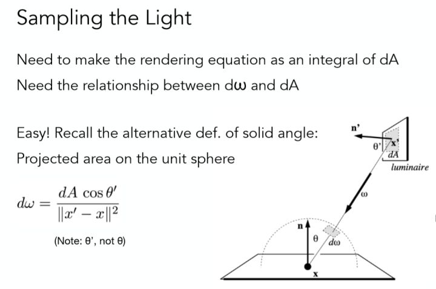
从而我们原来的渲染方程可以改为:
$$
L_o(x,\omega_o)=\int_AL_i(x,\omega_i)f_r(x,\omega_i,\omega_o)\frac{\cos\theta\cos\theta'}{||x-x'||^2}dA
$$
其中A是光源区域。
路径追踪的流程叙述如下(**规定光源是发光的物体，所以提到物体就表示其不发光**):
从摄像机位置到像素内某一采样点发出光线$-w_o$。
对于直接光照，对光源进行采样，计算其贡献，这分为两种情况：
1. 若采样的光线击中了光源，则按照公式计算;
2. 若采样的光线击中了某个物体，则跳过不计算。(这属于间接光照，在间接光照部分被计算)

对于间接光照，首先要进行一次俄罗斯轮盘赌来确定是否停止递归。随机向某个方向发出光线，同样分为两种情况:
1. 若击中光源，跳过不计算(这属于直接光照，已经计算过了)
2. 若击中某物体，递归调用函数计算击中点的着色值并加到结果上。
   
综上，路径追踪的实现代码如下:
```cpp
Vector3f Scene::castRay(const Ray& ray, int depth) const
{
    //1.求入射光线与场景的交点
    Vector3f light_dir, light_indir;
    Intersection wo_inter = intersect(ray);
    if (!wo_inter.happened)
    {
    	return { 0.f,0.f,0.f };
    }
    //如果产生了相交
    //2. 对光源均匀采样(获取采样点和对应概率)
    float pdf;
    Intersection ws_inter;
    sampleLight(ws_inter, pdf);

    //p是摄像机光线与物体的交点
    Vector3f p = wo_inter.coords;
    //x是在光源上采样的点
    Vector3f x = ws_inter.coords;
    //wo、ws分别是两条光线的方向
    Vector3f wo = ray.direction;
    Vector3f ws = (x - p).normalized();
    //N是物体平面的法向量，NN是光源平面的法向量
    Vector3f N = wo_inter.normal.normalized();
    Vector3f NN = ws_inter.normal.normalized();
    //emit是击中物体的发光
    Vector3f emit = ws_inter.emit;
    //3.从p到x发射一条光线(ws)，检测是否有物体阻挡
    Ray ws_ray(p, ws);
    Intersection ws_ray_intersection = intersect(ws_ray);
    //基于发射光线与物体的交点和光源采样点的距离判断是否被阻挡
    if ((ws_ray_intersection.coords - x).norm() <= EPSILON)
    {
    	//4.不被阻挡，则计算光源的直接光照(emit)
    	float dis = (x - p).norm();
    	light_dir = emit * wo_inter.m->eval(wo, ws, N) * dotProduct(ws, N) * dotProduct(-ws, NN) / (dis * dis) / pdf;
    }

    //5.先判断俄罗斯轮盘赌(RR)确定是否还要继续递归
    //获取[0,1)之间的实数ksi并与设定的RR比较
    float ksi = get_random_float();
    if (ksi > RussianRoulette)
    	return light_dir + light_indir;

    //6.从物体表面采样一个出射方向，构造相应光线wi_ray
    Vector3f wi = wo_inter.m->sample(wo, N).normalized();
    Ray wi_ray(p, wi);
    Intersection wi_inter = intersect(wi_ray);
    //若wi_ray与物体相交且该物体不发光(发光物体已经全部在直接光照部分考虑过，见sampleLight函数)
    if (wi_inter.happened && !wi_inter.m->hasEmission())
    {
    	light_indir = castRay(wi_ray, depth + 1) * wo_inter.m->eval(wo, wi, N) * dotProduct(wi, N) / wo_inter.m->pdf(wo, wi, N) / RussianRoulette;
    }

    return light_dir + light_indir;
}
```
实验中的函数调用路径图为:
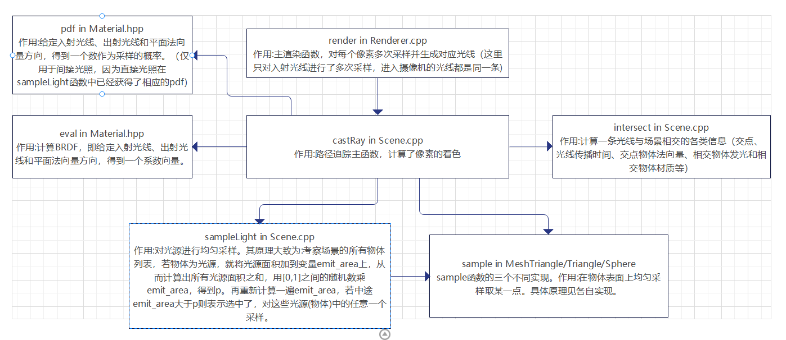
## 实验结果(初步)
需要注意的一点是，本次实验用debug模式渲染非常慢，所以应使用release模式进行优化处理。以下是两者时间的对比:
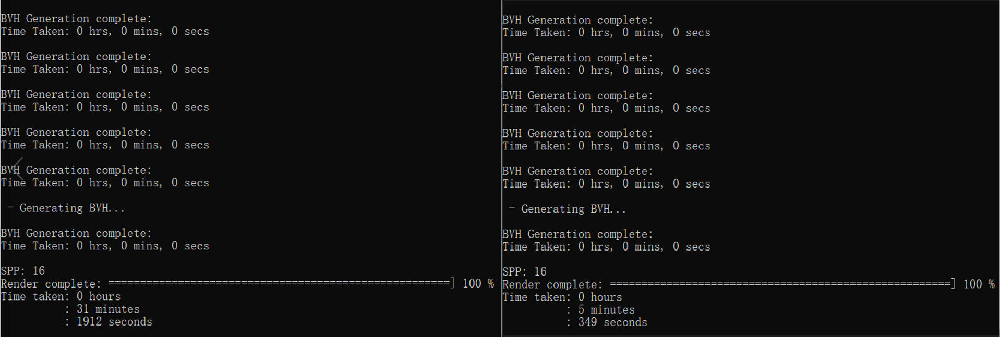
另外在global.hpp中的get_random_float函数效率很差，建议三个变量前都加上static关键字，渲染速度能提高很多(原本的5分钟减少到1分半左右)。
得到的实验结果如图:
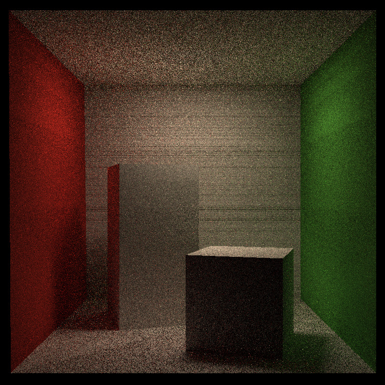
可以看到主要的问题：
1. 图片相较于参考结果较暗。
2. 光源部分为纯黑（没有被渲染）。
3. 有一些黑色横线。
## 优化尝试 
### 尝试1：增加每个像素点的采样数
spp=32的结果如下:
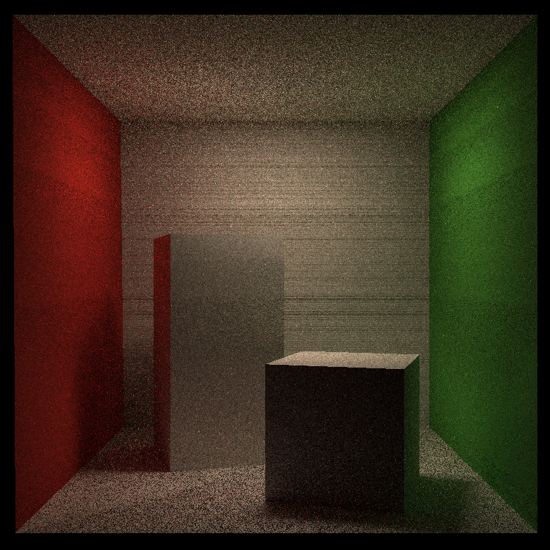
画面质量有一定提升（减小了随机性，噪点更少了），但没有解决上面的问题
### 尝试2：修改相交判定
考虑到浮点数精度问题，对intersect函数修改，增加一个epsilon项以减小误差：
```cpp
inline bool Bounds3::IntersectP(const Ray& ray, const Vector3f& invDir,
                                const std::array<int, 3>& dirIsNeg) const
{
    //...
     return t_min <= t_max + EPSILON && t_max >= 0;
}
```
结果:
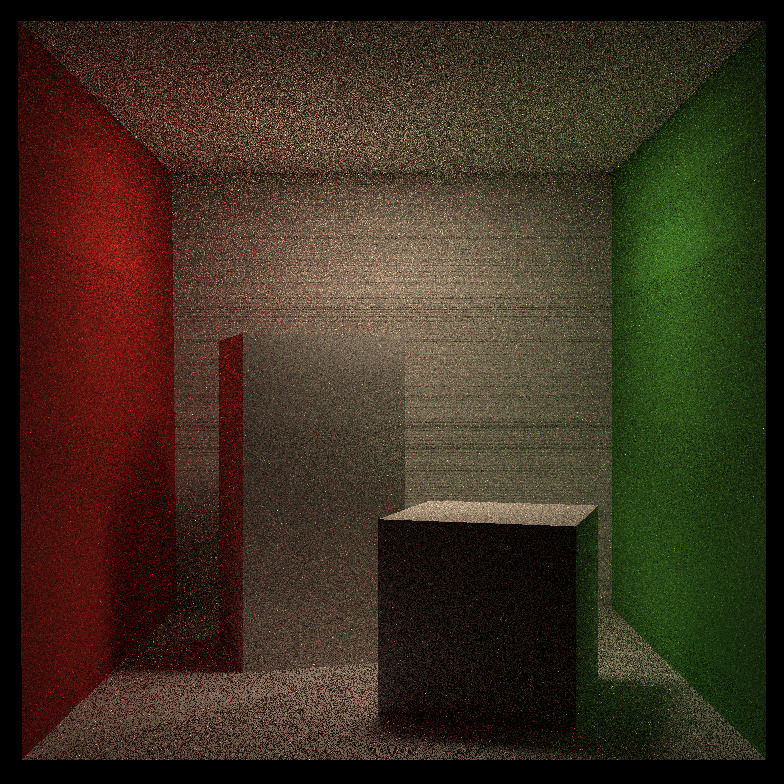
区别不大，可能是epsilon较小。
### 尝试3：调整epsilon大小
将epsilon=0.00001增大到0.0001，结果如下：
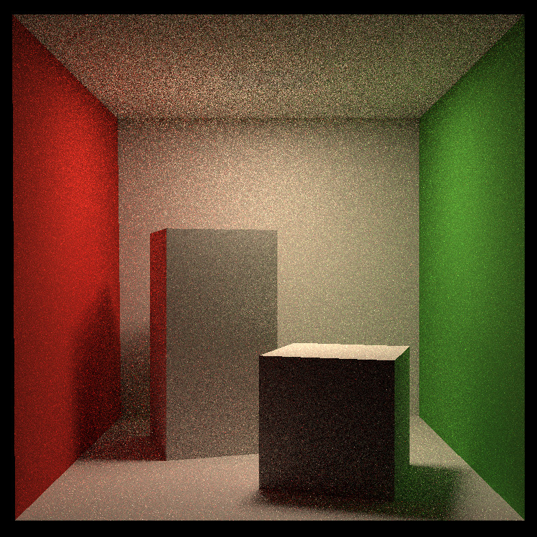
可以看到我们的问题1和3都解决了，因为在epsilon较小计算直接光照时，从光源采样的光线有可能计算时被误判了遮挡。
### 对光源的处理
现在还剩下没有光源的问题。按理来说，当眼睛直接看到光源时，其着色点p就在光源上，而**本次实验只有一个光源**，所以在调用sampleLight函数时，**采样到的点也必定是这个光源上的**，从而p和x两个点都在同一个平面上了，使得-ws·NN这一项始终为0,进而丢失了对光源的渲染。
解决方法也很简单，增加一个对入射光线wo击中物体是否是光源的判断，如果是就让light_dir加上一个光源强度(不能直接返回光源的强度，这样丢失了打到光源的间接光照)。顺便把后面计算直接光照的部分也改成+=。
```cpp
else if (wo_inter.m->hasEmission())
{
	light_dir += wo_inter.emit;
}
//...
light_dir += emit * wo_inter.m->eval(wo, ws, N) * dotProduct(ws, N) * dotProduct(-ws, NN) / (dis * dis) / pdf;
```
得到的结果为:
直接返回的结果为纯黑。
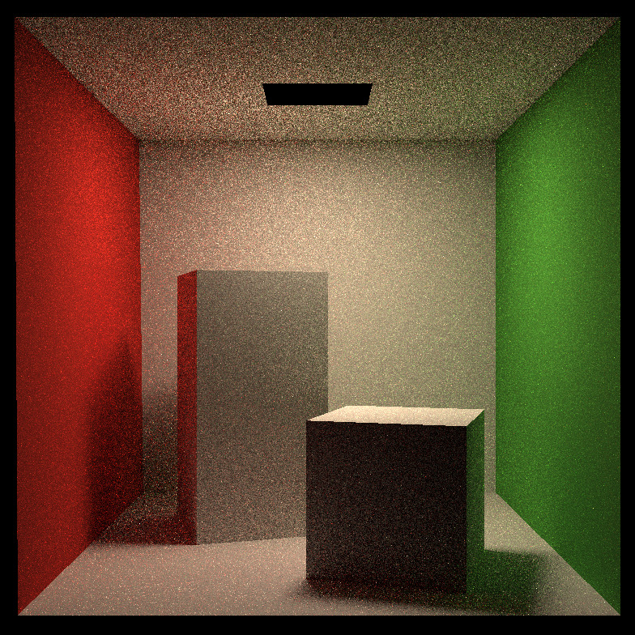
相加的结果和之前一样。
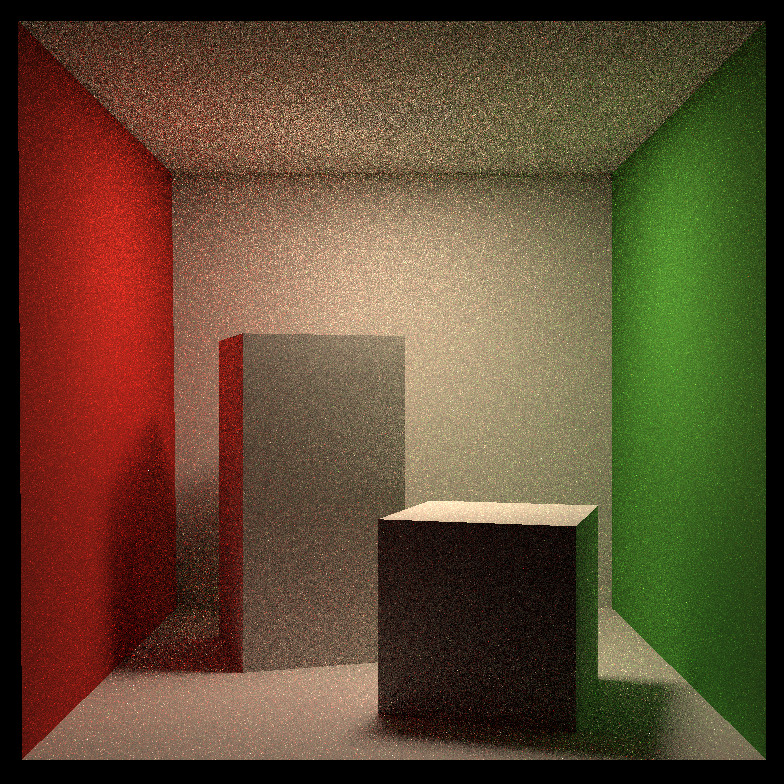
分析了一下，因为这里**这里光源是纯黑的**，说明根本没被赋值，原因是，Intersection类的emit变量在sampleLight时才会进行赋值，对于入射光线这种其emit值就显示为0了。
解决方法很简单，要么在getIntersection函数里给emit赋值，要么给light_dir加上材质的光照(getEmission)而非intersection的emit变量。
```cpp
    light_dir += wo_inter.m->getEmission();
```
## 最终结果
得到的结果如图:
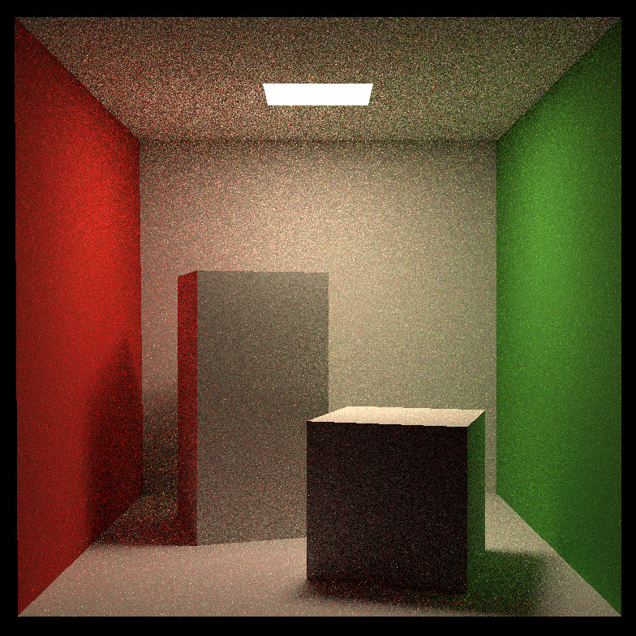
## 提高部分1:多线程
以下内容参考：
1. <https://zhuanlan.zhihu.com/p/397670985>
2. <https://www.cnblogs.com/mfryf/p/10205272.html>
需要在项目属性中开启OpenMP支持。
```
Configuration Properties -> C/C++ -> Language -> Open MP Support -> Yes (/openmp)
```
简单来说我们只需要添加一句
```cpp
#pragma omp parallel for
```
就能实现多线程了。主要需要修改的点：
1. 渲染进度的显示，如果不作改动的话进度的箭头就会错乱。
2. 对于各线程结果的整合。否则得到的结果会由于数据不同步而完全错误。
代码如下:
```cpp
	if (isMultiThreads)
	{
#pragma omp parallel for
		for (int j = 0; j < scene.height; ++j) {
			for (int i = 0; i < scene.width; ++i) {
				// generate primary ray direction
				float x = (2 * (i + 0.5) / (float)scene.width - 1) *imageAspectRatio * scale;
				float y = (1 - 2 * (j + 0.5) / (float)scene.height) * scale;

				Vector3f dir = normalize(Vector3f(-x, y, 1));

				for (int k = 0; k < spp; k++) {
					framebuffer[j * scene.width + i] += scene.castRay(Ray(eye_pos, dir), 0) / spp;
				}
#pragma omp atomic
				++m;
			}
#pragma omp critical
			UpdateProgress(m / float(scene.width) / float(scene.height));
		}
	}
```
第一层循环分给多个线程执行。注意**framebuffer数组下标必须改成**$j*scene.width+i$,否则渲染顺序不对。另外，使用atomic和critical来使更新进度条同步。
这样的写法能得到正确结果是因为，每个线程分配到的j是不一样的，从而在对framebuffer赋值的时候，其下标一定不和其他线程发生冲突。（换言之，不同进程之间**不共享变量**）
还有一种写法是多线程执行不用于第一层循环而是第二层循环，这样保证了j肯定是递增的，更新进度的方法就可以跟原本保持一致。
另外尝试了spp=32的情况下，第一层多线程、第二层多线程和两层都多线程的执行结果，结果是两层都执行多线程最快，但差距不大。本实验采用对第二层多线程的方法。
```cpp
if (isMultiThreads)
	{
		for (int j = 0; j < scene.height; ++j) {
#pragma omp parallel for
			for (int i = 0; i < scene.width; ++i) {
				// generate primary ray direction
				float x = (2 * (i + 0.5) / (float)scene.width - 1) *
					imageAspectRatio * scale;
				float y = (1 - 2 * (j + 0.5) / (float)scene.height) * scale;

				Vector3f dir = normalize(Vector3f(-x, y, 1));

				for (int k = 0; k < spp; k++) {
					framebuffer[j * scene.width + i] += scene.castRay(Ray(eye_pos, dir), 0) / spp;
				}
			}
			UpdateProgress(j / (float)scene.height);
		}
	}
```
利用多线程，渲染spp=512的结果如图:

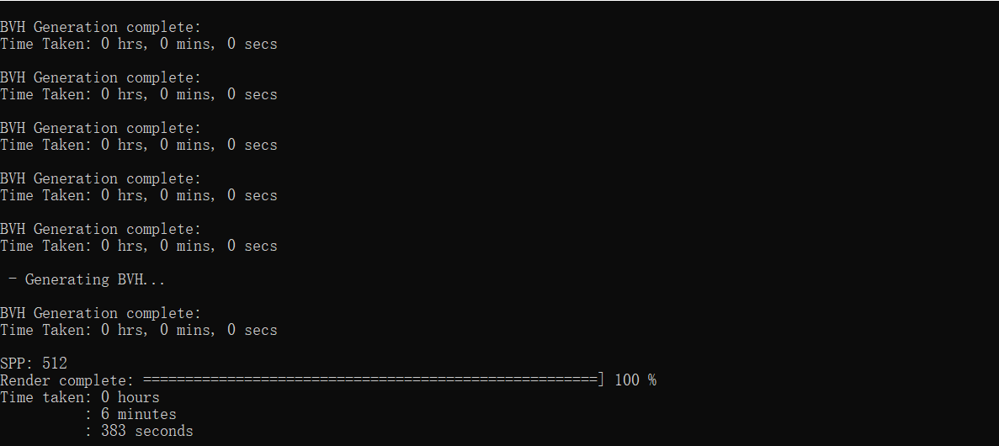
渲染spp=1024:
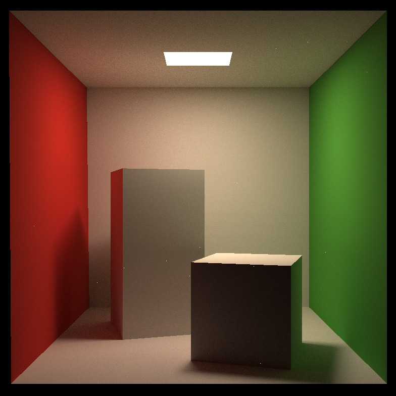
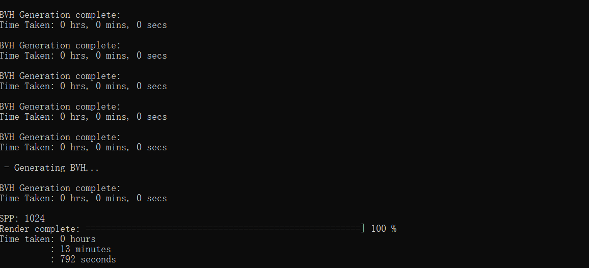
(spp=1024时出现了部分噪点，原因未知)
## 提高部分2：Microfacet微表面材质
参考：
1. <https://sites.cs.ucsb.edu/~lingqi/teaching/resources/GAMES101_Lecture_17.pdf>
2. <https://zhuanlan.zhihu.com/p/152226698>
3. <https://blog.csdn.net/qq_41835314/article/details/125362634>

我们在渲染方程部分使用BRDF，即$f_r$来计算人眼从某个方向接收到的光线，但问题在于，$f_r$这个系数是怎么计算的呢？
查看eval函数，其给出的结果是：
```cpp
Vector3f Material::eval(const Vector3f &wi, const Vector3f &wo, const Vector3f &N){
    switch(m_type){
        case DIFFUSE:
        {
            // calculate the contribution of diffuse   model
            float cosalpha = dotProduct(N, wo);
            if (cosalpha > 0.0f) {
                Vector3f diffuse = Kd / M_PI;
                return diffuse;
            }
            else
                return Vector3f(0.0f);
            break;
        }
    }
}
```
可以看到，结果是$\cfrac{k_d}{\pi}$，其中$k_d$是自定义系数。这其实就对应着漫反射的情况：假定所有入射光都**均匀反射向各个方向**，从而人眼接收到的反射光的来源的所有入射光**也一定能是均匀的**，也即**变量$f_r$应该是一个常数**,从而:
$$
L_o(\omega_o)=\int_{H^2}f_rL_i(\omega_i)\cos\theta_id\omega_i\\
=f_rL_i\int_{H^2}\cos\theta_id\omega_i\\
=\pi f_rL_i
$$
所以我们定义$f_r=\cfrac{\rho}{\pi}$，$\rho$为系数。
本提高部分探讨的微表面材质准确来说为Cook–Torrance光照模型。在前面的实验中，所有的物体材质都是漫反射，没有对镜面反射进行支持。
对于cook-Torrance光照模型来讲，其综合考虑了漫反射和镜面反射的影响。具体原理参考给出的链接，这里不再赘述。
主要在material.hpp中进行修改，添加相应的Microfacet材质内容。
因为这部分内容我不太懂，基本是照抄的别人代码，就不写了。
结果:
spp=512,roughness=0.8,Kd=(0.5,0.5,0.5),Ks=(0.8,0.8,0.8)
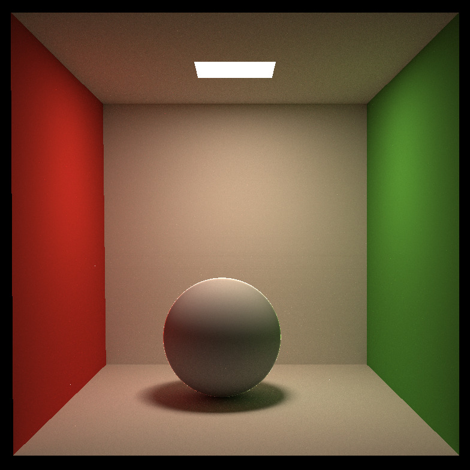